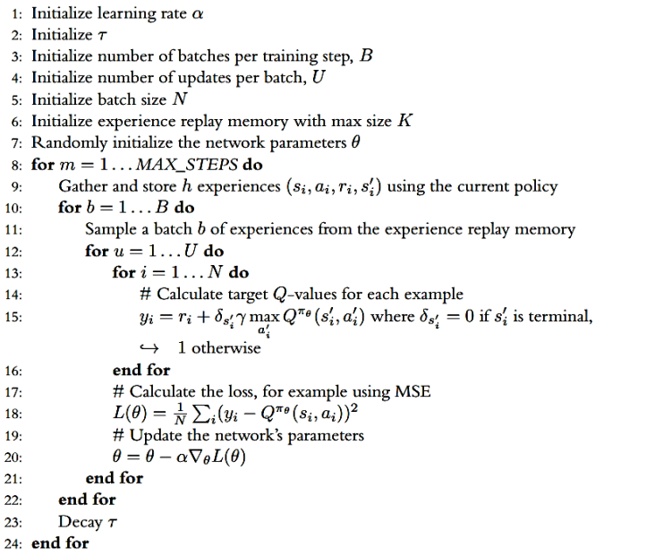
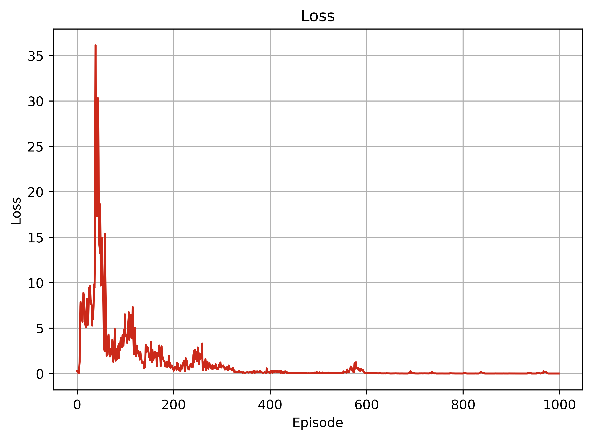
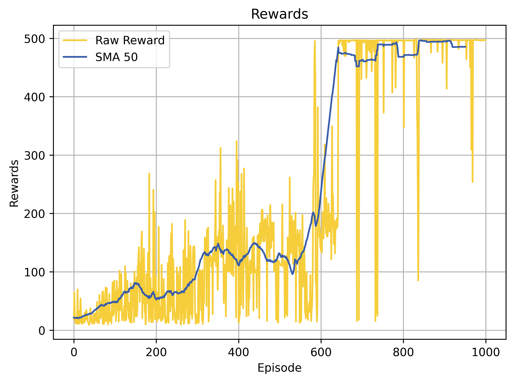
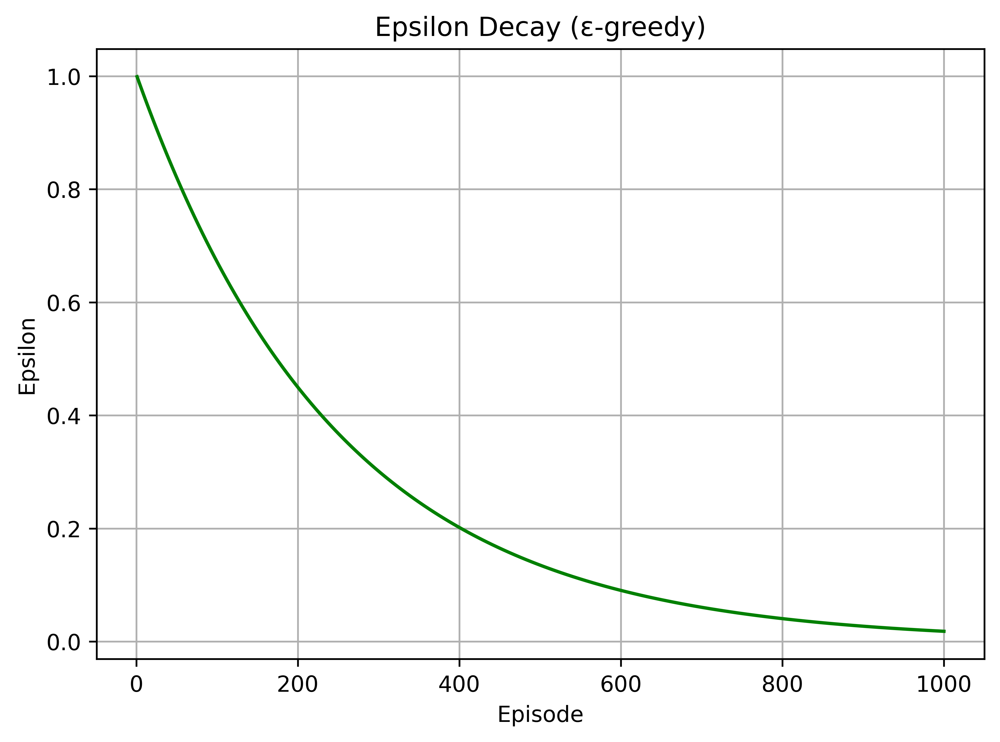
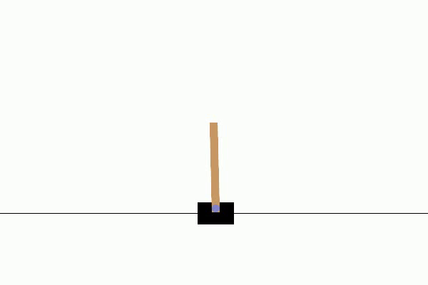

# README - DQN for CartPole

[](https://colab.research.google.com/drive/1-P1I0lxPf2scs4ZyOFb0tostuokrdm-v?usp=sharing)
[](https://www.python.org/downloads/release/python-380/)
[](https://github.com/MahanVeisi8/RL_practices/Cartpole/DQN/requirements.txt)

## Introduction
This repository contains the implementation of the Deep Q-Network (DQN) algorithm applied to the classic "Cart Pole" problem, which is a staple challenge in the field of reinforcement learning. Our project aims to demonstrate how DQN can effectively balance a pole on a moving cart through autonomous learning and decision-making processes.



## Table of Contents
- [Introduction](#introduction)
- [Setup](#setup)
  - [Prerequisites](#prerequisites)
- [Implementing DQN Components](#implementing-dqn-components)
  - [Replay Memory Class](#replay-memory-class)
  - [DQN Network Class](#dqn-network-class)
  - [DQN Agent Class](#dqn-agent-class)
  - [Model TrainTest Class](#model-traintest-class)
- [Results and Performance Analysis](#results-and-performance-analysis)
  - [Training Progress](#training-progress)
  - [Testing Phase](#testing-phase)
  - [Visualizing Agent Performance](#visualizing-agent-performance)
  - [Summary](#summary)

## Setup

**Running the Notebook in Google Colab**
- The notebook is designed for easy execution in Google Colab, requiring no additional setup other than a Google account and internet access.😊
  
The code is designed to run in a Python environment with essential machine learning and simulation libraries. You can execute the notebook directly in Google Colab using the badge link provided, which includes a pre-configured environment with all necessary dependencies.

### Prerequisites
To run this project locally, you need to install the following Python packages. This setup ensures you have all the required libraries:

```bash
pip install gymnasium
pip install torch
pip install matplotlib
pip install renderlab
```


## Implementing DQN Components

This section provides a detailed explanation of the DQN model's architecture, divided into several key components each responsible for a specific part of the learning process:

### Replay Memory Class

The `ReplayMemory` class efficiently manages and stores experiences, minimizing correlations between consecutive learning samples, which is crucial for the stability of our learning algorithms.

```py
    def __init__(self, capacity):
        # Initialize the memory buffer with a fixed size.
    def push(self, state, action, reward, next_state, done):
        # Store new experiences in the memory.
    def sample(self, batch_size):
        # Randomly sample a batch of experiences for training.
    def __len__(self):
        # Return the current number of experiences stored.
```

### DQN Network Class

The `DQN_Network` class defines the neural network architecture for approximating the Q-function, crucial for evaluating the best action to take in a given state.

```py
class DQN_Network(nn.Module):
    def __init__(self, input_dim, num_actions):
        # Setup the layers of the network with specified input dimensions and number of actions.
    def forward(self, x):
        # Define the forward pass to compute Q-values from the state inputs.
    def _initialize_weights(self):
        # Initialize network weights using appropriate schemes to ensure effective learning.
```

### DQN Agent Class

The `DQN_Agent` orchestrates the learning process, manages interactions with the environment, and updates network parameters based on the observed experiences.

```py
class DQN_Agent:
    def __init__(self, env, epsilon_max, epsilon_min, epsilon_decay, learning_rate, discount, memory_capacity):
        # Configure agent with environment, learning parameters, and exploration settings.
    def select_action(self, state):
        # Select an action using epsilon-greedy policy based on current Q-values.
    def learn(self, batch_size):
        # Perform a learning update using a batch of sampled experiences from memory.
    def update_epsilon(self):
        # Adjust the epsilon value for the epsilon-gready policy to balance exploration and exploitation.
    def save(self, path):
        # Save the current state of the network to a file.
    def hard_update(self):
        # Synchronize the weights of the target network with the main network.
```

### Model TrainTest Class

The `Model TrainTest` class orchestrates the complete lifecycle of training and testing the DQN agent, managing environment interactions, and systematically improving the agent's performance based on a set of hyperparameters.

```py
class Model_TrainTest:
    def __init__(self, agent, env, hyperparams):
        # Initialize the class with an agent, the environment, and training/testing settings.
    def state_preprocess(self, state):
        # Prepare the state for network input, potentially using encoding or normalization.
    def train(self):
        # Conduct the training operations, applying reward shaping to improve learning efficacy.
    def test(self, max_episodes):
        # Evaluate the agent's learned policy against unseen scenarios without exploring.
    def plot_training(self):
        # Visualize training progression with plots for rewards, losses, and epsilon values.
```

#### Reward Shaping in Training

An essential aspect of our training process is **reward shaping**, which involves modifying the reward function to make learning more efficient. This technique helps the agent learn faster and achieve better stability when balancing the pole:

- **Pole Angle Reward**: The agent receives a higher reward for keeping the pole closer to the vertical position. This is calculated by normalizing and inverting the angle of the pole relative to vertical, encouraging minimal deviation.
- **Cart Position Penalty**: To prevent the cart from reaching the edges of the track, a penalty is applied based on the cart's distance from the center. This keeps the actions focused on maintaining a central position.

These enhancements to the reward function are crucial for guiding the agent towards more desirable behaviors and are directly integrated into the training loop of the `Model_TrainTest` class. By adjusting the rewards based on the pole's angle and the cart's position, we significantly increase the stability and performance of the agent, making it adept at maintaining balance under varying conditions. Without it, our agent might still understand the best desicion but it will happen in much more epochs.


## Results and Performance Analysis

After intensive training and testing phases, our DQN agent demonstrates remarkable progress and efficiency in solving the CartPole problem. This section outlines the agent's performance across different training epochs and highlights its ability to generalize during testing phases.

### Training Progress

The agent was trained over 1000 episodes with the aim of maximizing the pole's balance duration on the cart. The learning process is quantified through plots that display the evolution of rewards, losses, and the agent's decision-making epsilon parameter over time.

#### Training Plots
<table>
  <tr>
    <td>Loss Plot<br></td>
    <td>Reward Plot<br></td>
    <td>Epsilon Decay Plot<br></td>
  </tr>
</table>

### Testing Phase

Testing of the trained models at different epochs (10, 500, and 1000) showcases the agent's improvement and stability over time. The results from these tests confirm the model's robustness and ability to generalize the learned policy to unseen scenarios.

- **Epoch 10**: Early stages of learning, where the agent's policy is still underdeveloped.
- **Epoch 500**: Midway through training, showing significant improvements in strategy and stability.
- **Epoch 1000**: Fully trained agent demonstrating optimal performance and decision-making capabilities.

### Visualizing Agent Performance

Animated GIFs and video sequences from test runs provide a visual confirmation of the agent's competence. These visual aids illustrate how the agent effectively balances the pole, adapting to different initial conditions and disturbances.

#### Performance Videos

<table>
  <tr>
    <td>Epoch 10<br></td>
    <td>Epoch 500<br></td>
    <td>Epoch 1000<br></td>
  </tr>
</table>

### Summary

This project successfully demonstrates the implementation of a Deep Q-Network to solve the Cart Pole challenge, a classic test in reinforcement learning. Our results, presented through detailed plots and animations, confirm the DQN's ability to learn and adapt effectively. Through progressive training, the model showcased significant improvements in strategy and performance, achieving stability and high accuracy in balancing the pole. This work not only validates the DQN approach but also sets the stage for further advancements and applications in dynamic decision-making environments.


