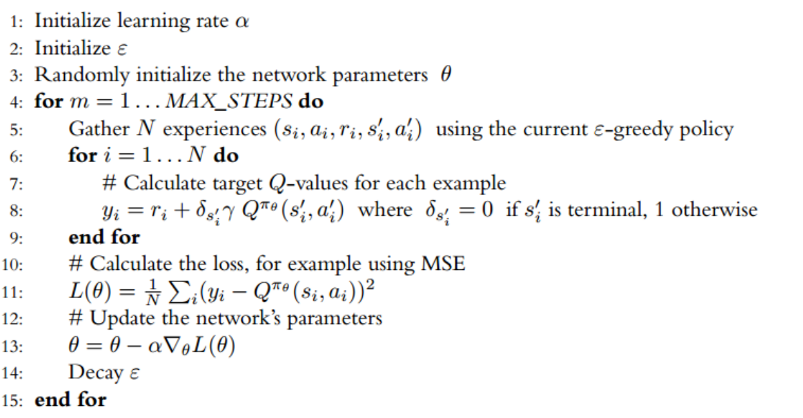
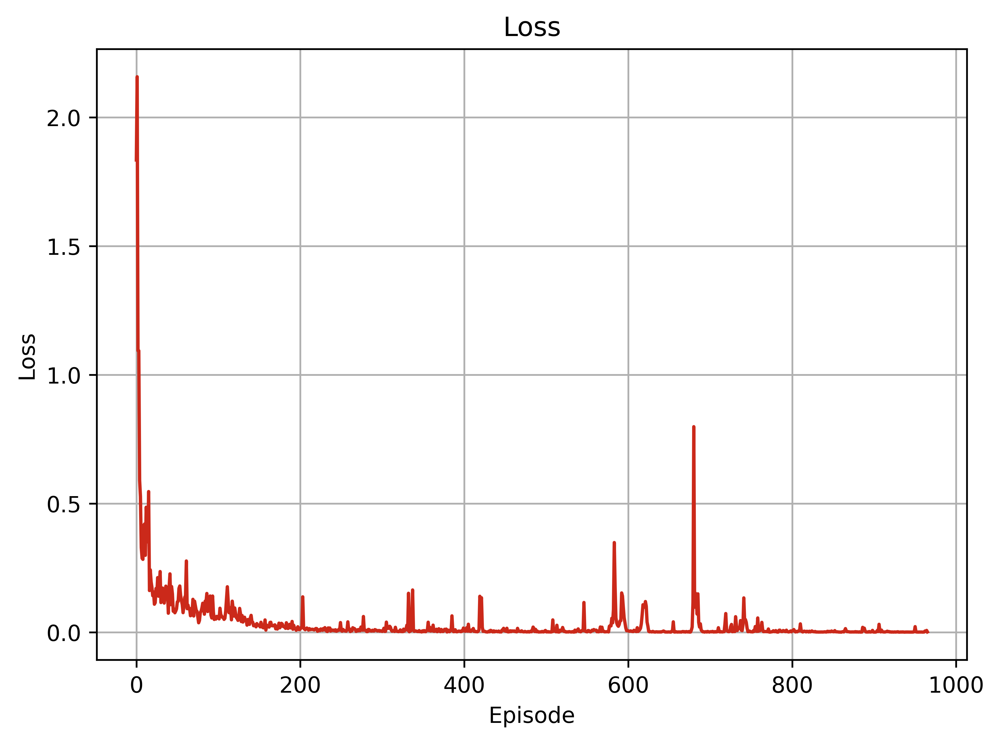
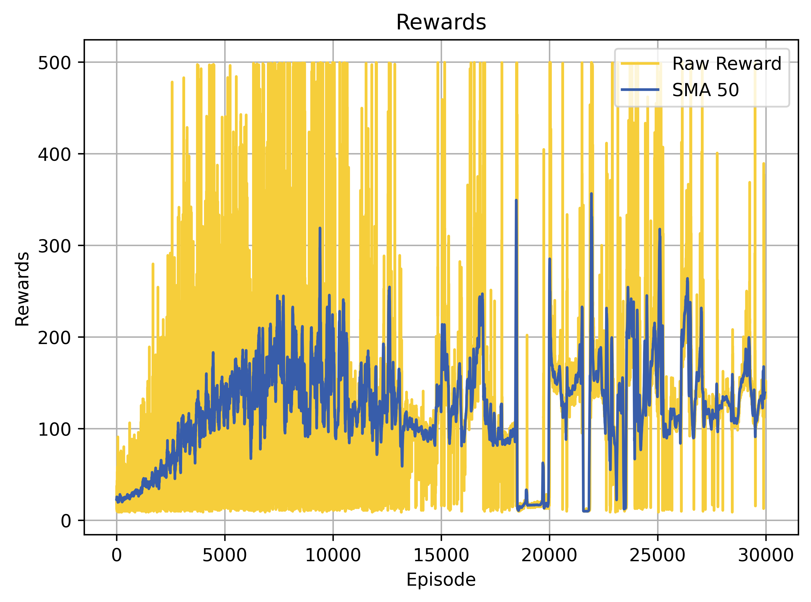
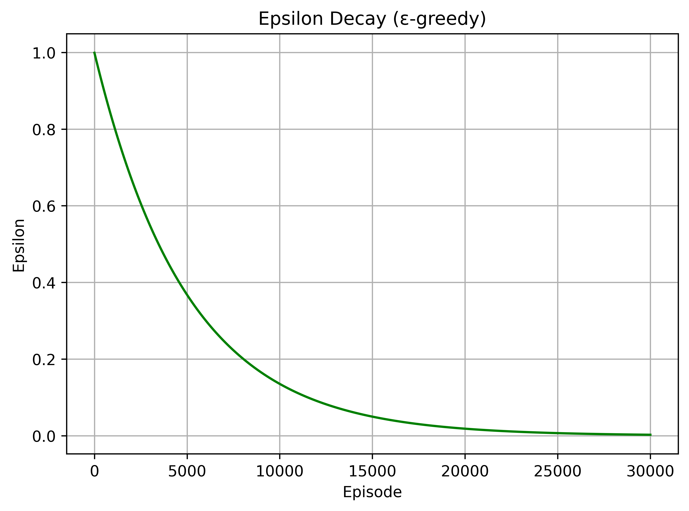
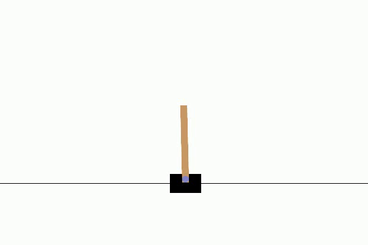
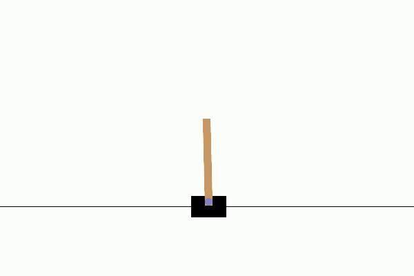

# SARSA for Cart Pole Problem

[](https://colab.research.google.com/drive/16hRNXngPzT1Yaw_xO7B3Jy0ljUtjA_B6?usp=sharing)
[](https://www.python.org/)
[](https://github.com/MahanVeisi8/RL_practices/Cartpole/4%20-%SARSA/requirements.txt)

## Table of Contents
- [Introduction](#introduction)
- [Objectives](#objectives)
- [Setup](#setup)
- [Implementing SARSA Components](#implementing-sarsa-components)
  - [Memory Class](#memory-class)
  - [SARSA Network Class](#sarsa-network-class)
  - [SARSA Agent Class](#sarsa-agent-class)
  - [Model TrainTest Class](#model-traintest-class)
  - [Results and Performance Analysis](#results-and-performance-analysis)
  - [Insights from Detailed Analysis](#insights-from-detailed-analysis)
  - [Training Plots](#training-plots)
- [Testing Phase](#testing-phase)
  - [Visualizing Agent Performance](#visualizing-agent-performance)
- [Conclusions](#conclusions)

## Introduction

This project applies the State-Action-Reward-State-Action (SARSA) reinforcement learning algorithm to the classic "Cart Pole" problem. Our objective is to balance a pole, hinged to a moving cart, by strategically moving the cart left or right.


## Objectives

- Implement the SARSA algorithm using PyTorch

- Train the SARSA model to maintain the balance of the pole on the moving cart for extended periods.
- Evaluate the performance and learning stability of the SARSA algorithm.

## Setup

**Running the Notebook in Google Colab**
- The notebook is designed for easy execution in Google Colab, requiring no additional setup other than a Google account and internet access.😊

### Prerequisites
To run this project locally, you need to install the following Python packages. This setup ensures you have all the required libraries:

```bash
pip install gymnasium
pip install torch
pip install matplotlib
pip install renderlab
```

## Implementing SARSA Components

This section outlines the implementation of the SARSA algorithm's architecture, which is structured around several key components that each play a critical role in the learning process:

### Memory Class

The `Memory` class is responsible for storing experiences that the SARSA agent encounters, which are later used to update the agent's learning model, ensuring a diverse set of experiences influence the learning process.

```py
class Memory:
    def __init__(self, capacity):
        # Initialize replay memory with a specified capacity.
    def store(self, state, action, next_state, next_action, reward, done):
        # Store an experience tuple in the replay memory.
    def get_all(self):
        # Retrieve all stored experiences for learning updates.
    def clear(self):
        # Clear all contents of the memory to reset the learning history.
```

### SARSA Network Class

The `SARSA_Network` defines the neural network architecture used to estimate Q-values for each action given a state input. This component is crucial for the SARSA agent to evaluate possible actions from each state.

```py
class SARSA_Network(nn.Module):
    def __init__(self, num_actions, input_dim):
        # Initialize neural network layers and setup architecture.
    def forward(self, x):
        # Process input state to output Q-values for each action.
    def _initialize_weights(self):
        # Initialize weights to facilitate effective learning.
```

### SARSA Agent Class

The `SARSA_Agent` manages the interaction with the environment, decision making based on the current policy, and updates the policy based on observed transitions.

```py
class SARSA_Agent:
    def __init__(self, env, epsilon_max, epsilon_min, epsilon_decay, clip_grad_norm, learning_rate, discount, memory_capacity):
        # Setup agent with environment and learning parameters.
    def select_action(self, state):
        # Select an action using an epsilon-greedy approach for the given state.
    def learn(self, done):
        # Update the policy based on stored experiences and observed rewards.
    def update_epsilon(self):
        # Gradually decrease epsilon to reduce the exploration rate over time.
    def save(self, path):
        # Save the model's state dictionary for later use.
    def hard_update(self):
        # Synchronize the weights of the target network with the main network.
```

### Model TrainTest Class

The `Model_TrainTest` manages the full lifecycle of training and testing the SARSA agent, coordinating environment interactions and systematic improvements based on a set of training hyperparameters.

```py
class Model_TrainTest:
    def __init__(self, hyperparams):
        # Initialize with hyperparameters and set up the environment and agent.
    def state_preprocess(self, state, num_states):
        # Convert state information for network input, potentially normalizing.
    def train(self):
        # Execute the training process, modifying rewards to improve learning efficacy.
    def test(self, max_episodes):
        # Evaluate the agent's policy against new scenarios without further exploration.
    def plot_training(self, episode):
        # Visualize training progress with plots for rewards, losses, and epsilon decay.
```

### Results and Performance Analysis

After extensive training, our SARSA agent has shown impressive progress and efficiency in solving the CartPole problem. This section discusses the agent's performance throughout different stages of training and its ability to generalize during the testing phases.

### Insights from Detailed Analysis

- **Memory Usage**: Unlike DQN, the SARSA algorithm does not use a replay buffer to reuse old experiences. Instead, each experience is used once for an update and then discarded. This approach ensures that learning is always based on the most recent experiences, although it may slow down the learning process because the agent does not benefit from the potentially useful repetitive exposure to the same experiences.

- **Learning Rate and Episode Count**: The non-repetitive use of experiences suggests a need for a larger number of episodes to achieve comparable performance to techniques like DQN, which can reuse experiences for multiple updates. Our setup uses a high `max_episode` count and an `epsilon_decay` rate designed to accommodate this learning style, ensuring gradual but steady improvement.

- **Potential for Enhancement**: Allowing experiences to contribute to multiple updates before being discarded might improve performance. Future iterations of this project could explore a hybrid approach where experiences are used more than once before clearing, potentially accelerating the learning process and enhancing stability.

#### Training Plots
<table>
  <tr>
    <td>Loss Plot<br></td>
    <td>Reward Plot<br></td>
    <td>Epsilon Decay Plot<br></td>
  </tr>
</table>

### Testing Phase

Testing of the trained models at different epochs (10, 15,000, and 30,000) helped to evaluate the agent's improvement and stability over time. While the agent demonstrated some learning and adaptation, it did not achieve the high stability or consistent optimal performance seen in more robust reinforcement learning models.

- **Epoch 10**: At this early stage of learning, the agent's policy is underdeveloped, achieving only brief durations of pole balancing, indicative of its initial exploratory strategies.
- **Epoch 15,000**: Midway through training, the agent shows some improvements in strategy and pole balancing duration, but it does not consistently achieve high rewards or stability.
- **Epoch 30,000**: Although there is significant learning compared to the initial epochs, the agent still struggles to maintain long-term balance, indicating the need for further optimization or exploration of alternative strategies.

### Visualizing Agent Performance

The visual aids from test runs illustrate the agent's real-time performance at various stages. Despite some progressive improvement, the agent fails to consistently balance the pole for extended periods or adapt to varying conditions robustly.

#### Performance Videos

<table>
  <tr>
    <td>Epoch 10<br></td>
    <td>Epoch 15000<br></td>
    <td>Epoch 30000<br></td>
  </tr>
</table>


### Summary

Our SARSA implementation has shown partial success in adapting to the Cart Pole challenge but did not achieve the optimal stability or high reward benchmarks. The plots and visual evidence point to an improvement in strategy over time, yet they also highlight the algorithm’s limitations in maintaining long-term balance without further tuning or enhanced learning strategies.

## Conclusions

This project underscores the practical challenges of applying the SARSA algorithm to dynamic tasks like the Cart Pole problem. The results reveal substantial room for improvement, particularly in achieving consistent performance across all stages of learning. These findings suggest the potential need for incorporating mechanisms like replay memory or exploring more sophisticated policy enhancements to achieve better stability and reliability in decision-making environments.
