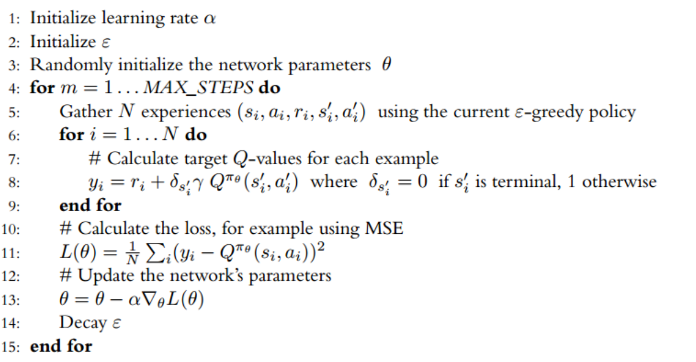

# SARSA for Cart Pole Problem

## Introduction

This project applies the State-Action-Reward-State-Action (SARSA) reinforcement learning algorithm to the classic "Cart Pole" problem. Our objective is to balance a pole, hinged to a moving cart, by strategically moving the cart left or right.


## Objectives

- Implement the SARSA algorithm using PyTorch

- Train the SARSA model to maintain the balance of the pole on the moving cart for extended periods.
- Evaluate the performance and learning stability of the SARSA algorithm.

## Table of Contents

- [Introduction](#introduction)
- [Objectives](#objectives)
- [Setup](#setup)
- [SARSA Implementation](#sarsa-implementation)
  - [Agent Design](#agent-design)
  - [Network Architecture](#network-architecture)
- [Training Process](#training-process)
- [Testing](#testing)
- [Results](#results)
- [Conclusions](#conclusions)

## Setup

**Running the Notebook in Google Colab**
- The notebook is designed for easy execution in Google Colab, requiring no additional setup other than a Google account and internet access.😊

### Prerequisites
To run this project locally, you need to install the following Python packages. This setup ensures you have all the required libraries:

```bash
pip install gymnasium
pip install torch
pip install matplotlib
pip install renderlab
```


Got it! Here’s a refined version of the SARSA implementation section formatted similarly to your DQN README, focusing on explaining the components using concise code snippets and descriptions:

```md
## Implementing SARSA Components

This section outlines the implementation of the SARSA algorithm's architecture, which is structured around several key components that each play a critical role in the learning process:

### Memory Class

The `Memory` class is responsible for storing experiences that the SARSA agent encounters, which are later used to update the agent's learning model, ensuring a diverse set of experiences influence the learning process.

```py
class Memory:
    def __init__(self, capacity):
        # Initialize replay memory with a specified capacity.
    def store(self, state, action, next_state, next_action, reward, done):
        # Store an experience tuple in the replay memory.
    def get_all(self):
        # Retrieve all stored experiences for learning updates.
    def clear(self):
        # Clear all contents of the memory to reset the learning history.
```

### SARSA Network Class

The `SARSA_Network` defines the neural network architecture used to estimate Q-values for each action given a state input. This component is crucial for the SARSA agent to evaluate possible actions from each state.

```py
class SARSA_Network(nn.Module):
    def __init__(self, num_actions, input_dim):
        # Initialize neural network layers and setup architecture.
    def forward(self, x):
        # Process input state to output Q-values for each action.
    def _initialize_weights(self):
        # Initialize weights to facilitate effective learning.
```

### SARSA Agent Class

The `SARSA_Agent` manages the interaction with the environment, decision making based on the current policy, and updates the policy based on observed transitions.

```py
class SARSA_Agent:
    def __init__(self, env, epsilon_max, epsilon_min, epsilon_decay, clip_grad_norm, learning_rate, discount, memory_capacity):
        # Setup agent with environment and learning parameters.
    def select_action(self, state):
        # Select an action using an epsilon-greedy approach for the given state.
    def learn(self, done):
        # Update the policy based on stored experiences and observed rewards.
    def update_epsilon(self):
        # Gradually decrease epsilon to reduce the exploration rate over time.
    def save(self, path):
        # Save the model's state dictionary for later use.
    def hard_update(self):
        # Synchronize the weights of the target network with the main network.
```

### Model TrainTest Class

The `Model_TrainTest` manages the full lifecycle of training and testing the SARSA agent, coordinating environment interactions and systematic improvements based on a set of training hyperparameters.

```py
class Model_TrainTest:
    def __init__(self, hyperparams):
        # Initialize with hyperparameters and set up the environment and agent.
    def state_preprocess(self, state, num_states):
        # Convert state information for network input, potentially normalizing.
    def train(self):
        # Execute the training process, modifying rewards to improve learning efficacy.
    def test(self, max_episodes):
        # Evaluate the agent's policy against new scenarios without further exploration.
    def plot_training(self, episode):
        # Visualize training progress with plots for rewards, losses, and epsilon decay.
```

## Training Process

The training process involves running the SARSA agent through multiple episodes, updating the policy based on observed rewards and transitions, and adjusting the epsilon value to manage the exploration-exploitation trade-off.

### Hyperparameters

- Learning Rate: 0.001
- Discount Factor: 0.99
- Epsilon Decay: 0.995

## Testing

The model's performance is evaluated by testing it on new episodes and observing its ability to maintain the pole's balance. This phase helps verify the effectiveness of the learned policies.

## Results

Results include plots of rewards, losses, and the epsilon decay over training episodes, illustrating the learning progression and effectiveness of the SARSA algorithm.

## Conclusions

The project demonstrates the application of the SARSA algorithm to a classic problem in reinforcement learning. The results show how the algorithm performs under different conditions and provide insights into its learning capabilities and stability.
