# Boltzmann Exploration in DQN Agents

[](https://colab.research.google.com/drive/19wuWHiw_GGcXLqzsA12ljOp44NmNNZiw?usp=sharing)
[](https://www.python.org/)
[]()

## Introduction 🚀
This repository demonstrates the implementation of Boltzmann exploration (also known as softmax action selection) in Deep Q-Networks (DQN) for solving the Cart Pole problem. Unlike traditional epsilon-greedy strategies, Boltzmann exploration provides a probabilistic approach to action selection that may improve the exploration-exploitation balance by using a temperature parameter to modulate action choice probabilities based on their Q-values.

## Table of Contents
- [Setup](#setup)
- [Boltzmann Exploration](#boltzmann-exploration)
- [Hyperparameter Impact](#hyperparameter-impact)
  - [Experiment Setup](#experiment-setup)
  - [Results](#results)
- [Conclusions](#conclusions)

## Setup 🛠️
**Running the Notebook in Google Colab**
- The notebook is designed for easy execution in Google Colab, requiring no additional setup other than a Google account and internet access.

**Installation of Required Libraries**
```bash
pip install gymnasium torch matplotlib renderlab
```

**Importing Libraries**
Ensure all necessary libraries, including PyTorch, Gymnasium, and others, are imported for the project.

## Boltzmann Exploration 🔍
Detailed explanation of how Boltzmann exploration differs from epsilon-greedy strategies that we used in the previous practices, including:
- Initialization changes: Removal of epsilon parameters and introduction of temperature-related parameters.
- Action selection modifications to utilize the Boltzmann distribution.
  ```py
      def select_action(self, state):
        """
        Select an action using Boltzmann exploration.
        """
        action_probs = self.get_action_probs(state)
        action = np.random.choice(len(action_probs), p=action_probs)
        return action

    def get_action_probs(self, state):
        """
        Get action probabilities using Boltzmann distribution.
        """
        with torch.no_grad():
            Q_values = self.main_network(state)
            action_values = Q_values / self.temperature
            action_probs = torch.softmax(action_values, dim=-1).cpu().numpy()
        return action_probs
  ```
- Temperature decay mechanism to adjust exploration intensity over time.
  ```py
  def update_temperature(self):
        self.temperature = max(self.temperature * self.temperature_decay, self.temperature_min)
  ```
  

## Hyperparameter Impact 📉
### Experiment Setup
Exploration of how different temperature settings influence the learning process and agent performance. The key parameters are:

- **`temperature_max`**: The initial temperature value at the start of training, which determines the level of exploration. A higher `temperature_max` encourages more exploratory actions.
- **`temperature_min`**: The minimum temperature value that the system will decay to, ensuring that exploration doesn't cease entirely. This parameter helps maintain a baseline level of exploration throughout training.
- **`temperature_decay`**: The rate at which the temperature decreases over time. This decay rate controls how quickly the exploration level transitions to more exploitative behavior as training progresses.

These parameters collectively influence the agent's ability to balance exploration of new actions and exploitation of known rewarding actions.

### Hyperparameter Settings

<table style="border-spacing: 80px; width: 100%;">
  <tr>
    <td style="vertical-align: top;">
      <strong>Set 1: High Exploration</strong>
      <table style="width: 100%; border: 15px solid black; padding: 50px;">
        <tr><th>Parameter</th><th>Value</th></tr>
        <tr><td>temperature_max</td><td>1000</td></tr>
        <tr><td>temperature_min</td><td>0.0001</td></tr>
        <tr><td>temperature_decay</td><td>0.995</td></tr>
      </table>
    </td>
    <td style="vertical-align: top;">
      <strong>Set 2: Moderate Exploration</strong>
      <table style="width: 100%; border: 15px solid black; padding: 50px;">
        <tr><th>Parameter</th><th>Value</th></tr>
        <tr><td>temperature_max</td><td>10</td></tr>
        <tr><td>temperature_min</td><td>0.0001</td></tr>
        <tr><td>temperature_decay</td><td>0.995</td></tr>
      </table>
    </td>
  </tr>
  <tr>
    <td style="vertical-align: top;">
      <strong>Set 3: Low Exploration</strong>
      <table style="width: 100%; border: 15px solid black; padding: 50px;">
        <tr><th>Parameter</th><th>Value</th></tr>
        <tr><td>temperature_max</td><td>0.1</td></tr>
        <tr><td>temperature_min</td><td>0.0001</td></tr>
        <tr><td>temperature_decay</td><td>0.995</td></tr>
      </table>
    </td>
    <td style="vertical-align: top;">
      <strong>Set 4: Constant Temperature</strong>
      <table style="width: 100%; border: 15px solid black; padding: 50px;">
        <tr><th>Parameter</th><th>Value</th></tr>
        <tr><td>temperature_max</td><td>1</td></tr>
        <tr><td>temperature_min</td><td>0.0001</td></tr>
        <tr><td>temperature_decay</td><td>1</td></tr>
      </table>
    </td>
  </tr>
</table>


### Comparative Analysis of Results

The table below presents a detailed comparison of how different temperature settings influence the agent's learning dynamics and performance. Each row corresponds to a hyperparameter set as described above, showcasing the outcomes through visual plots and a brief description of the training behavior and results.

| Set | Description | Temperature Plot | Loss Plot | Reward Plot |
|-----|-------------|------------------|-----------|-------------|
| **Set 1** <br> High Initial Temperature | Starts at 1000, promoting extensive early exploration. As exploration decreases, noticeable stabilization and gradual improvements in performance occur, suggesting effective balancing of exploration with exploitation over time. | 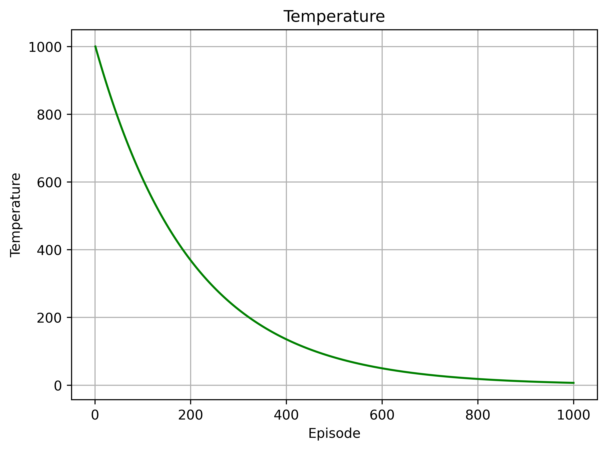 | 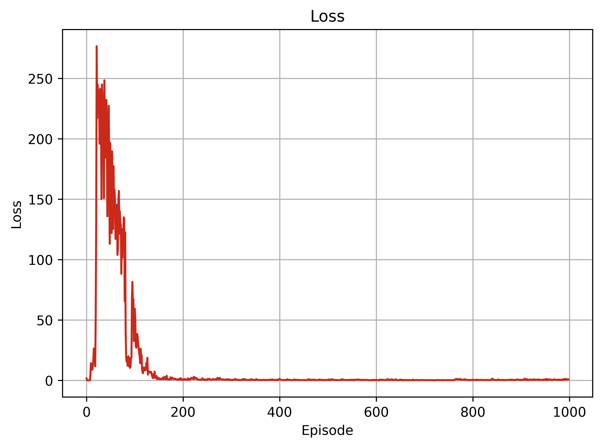 | 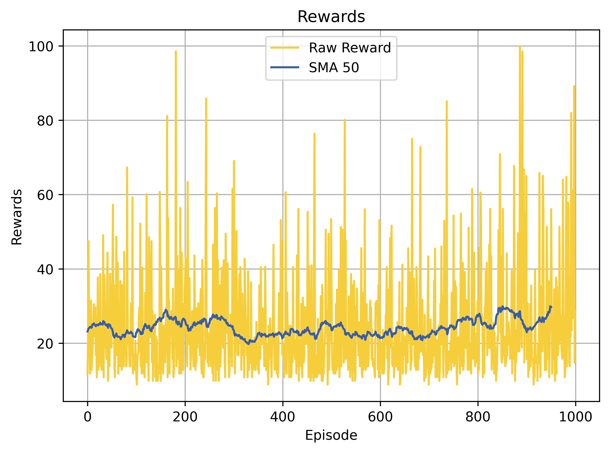 |
| **Set 2** <br> Moderate Initial Temperature | Starts at 10, fostering a balance from the beginning. Results in steady progress with less volatility in performance metrics compared to higher initial temperatures, indicating more consistent learning. | 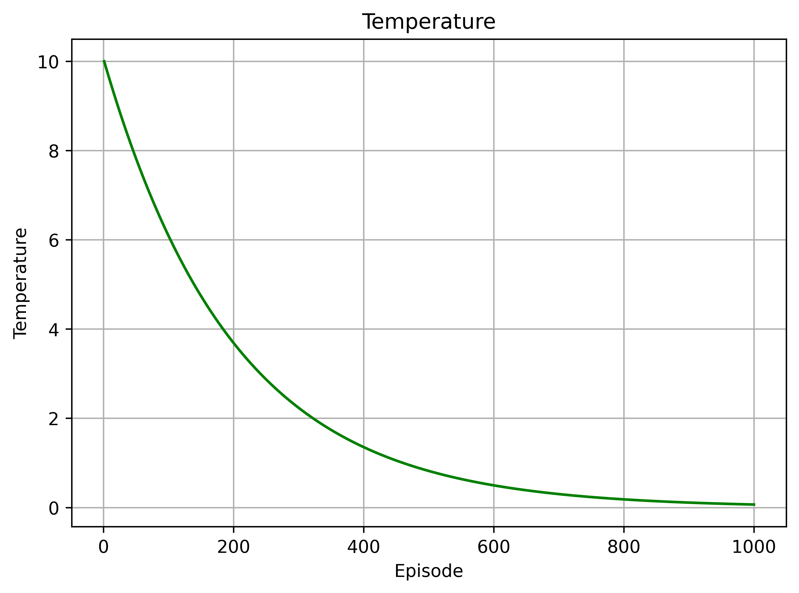 | 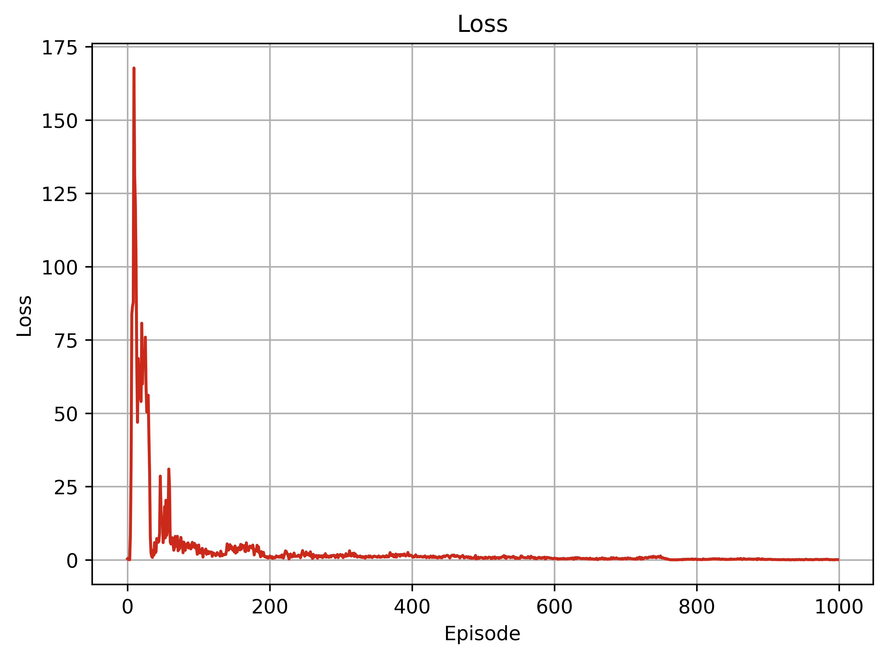 | 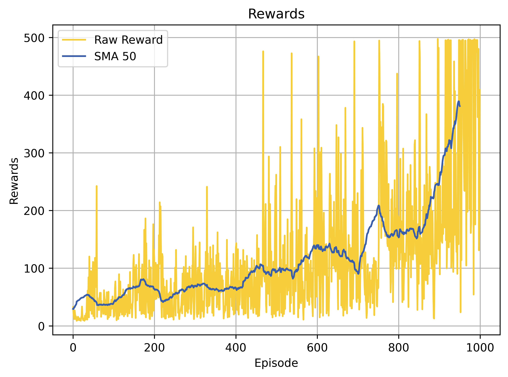 |
| **Set 3** <br> Low Initial Temperature | With an initial temperature of 0.1, the model is highly exploitative, limiting exploration which may hinder learning in complex scenarios but accelerates performance in simpler tasks or familiar environments. | 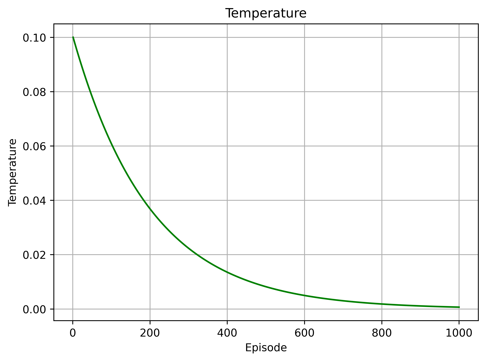 | 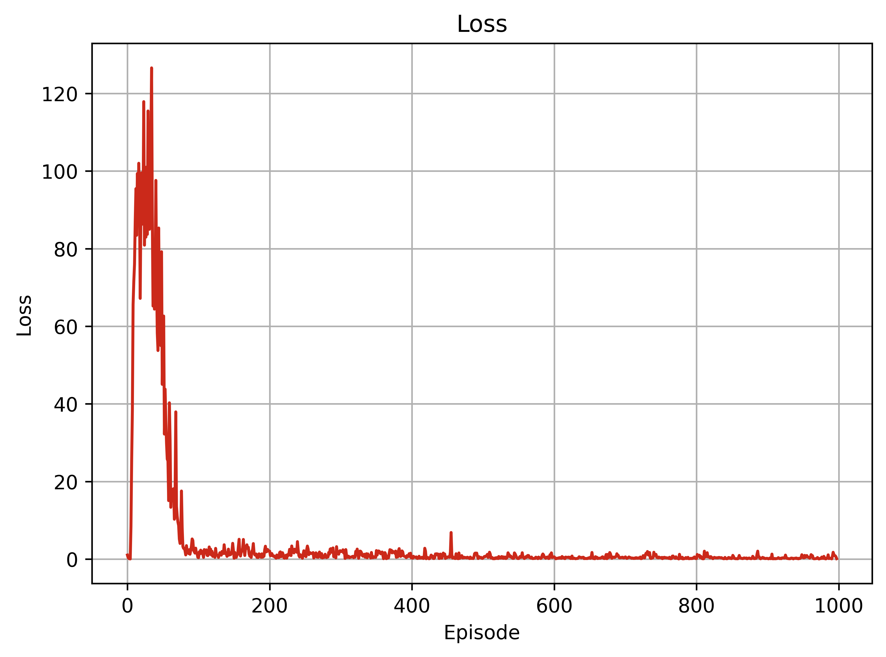 | 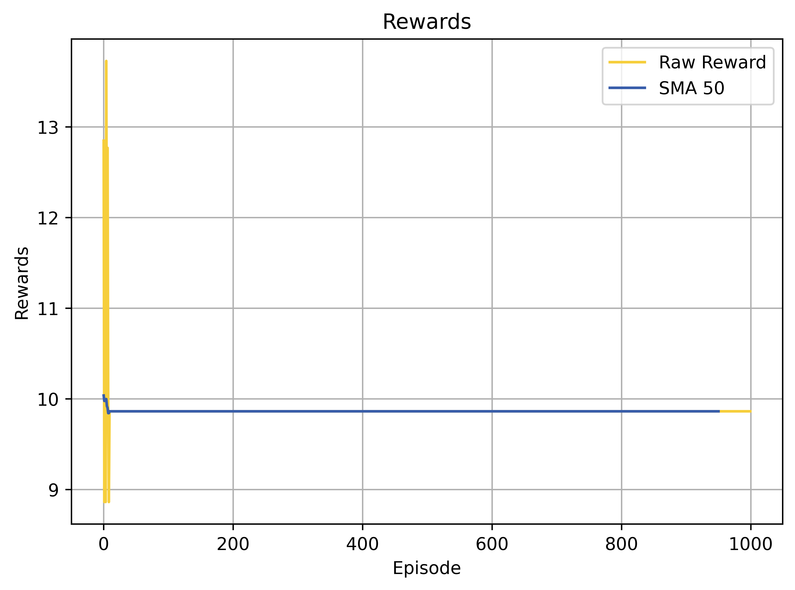 |
| **Set 4** <br> Constant Temperature | Maintains a steady temperature of 1, ensuring consistent exploration. This method can be particularly effective in environments where the dynamics do not vary much, maintaining a steady exploration rate throughout the training process. | 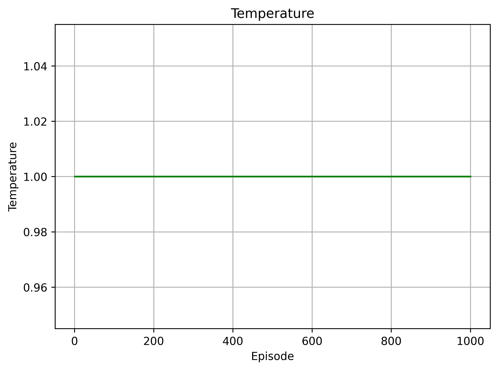 | 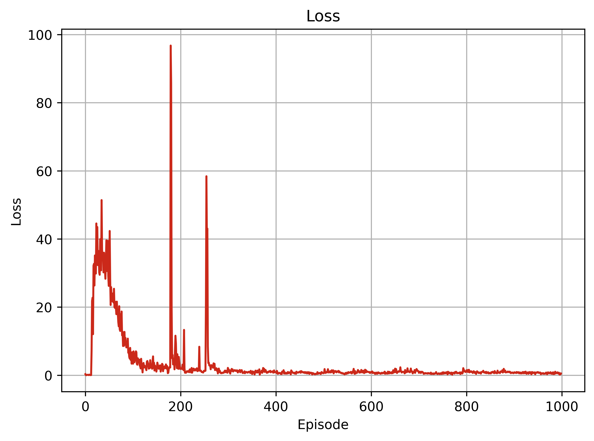 | 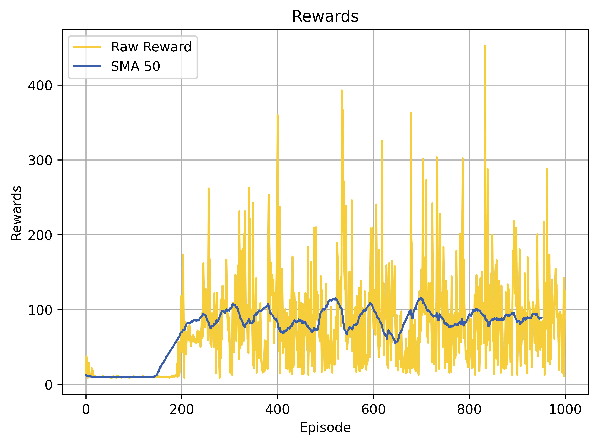 |


## Conclusions 📝
Summary of key findings from the Boltzmann exploration experiments, highlighting optimal settings for different scenarios and the trade-offs between exploration and exploitation based on the temperature parameter.

## How to Run 🏃‍♂️
Instructions on how to clone, set up, and run the project for personal experimentation and learning.
