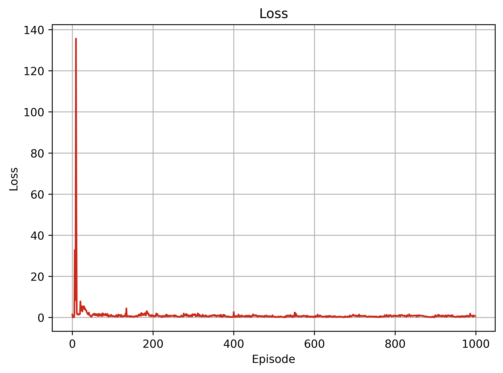
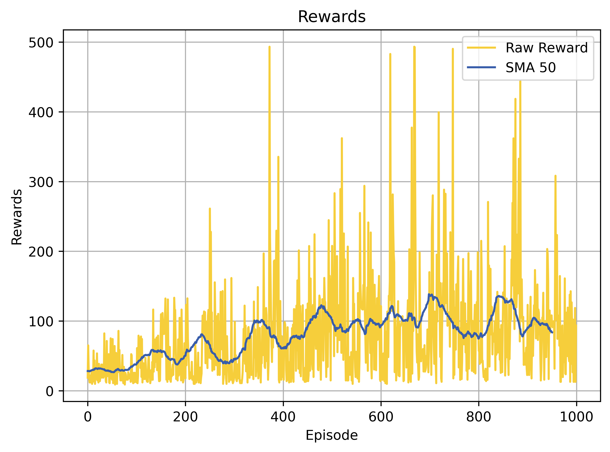
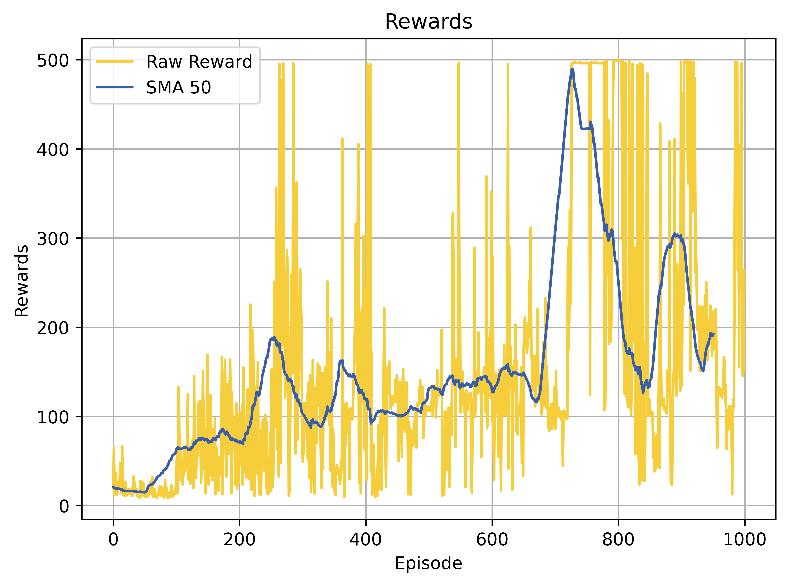
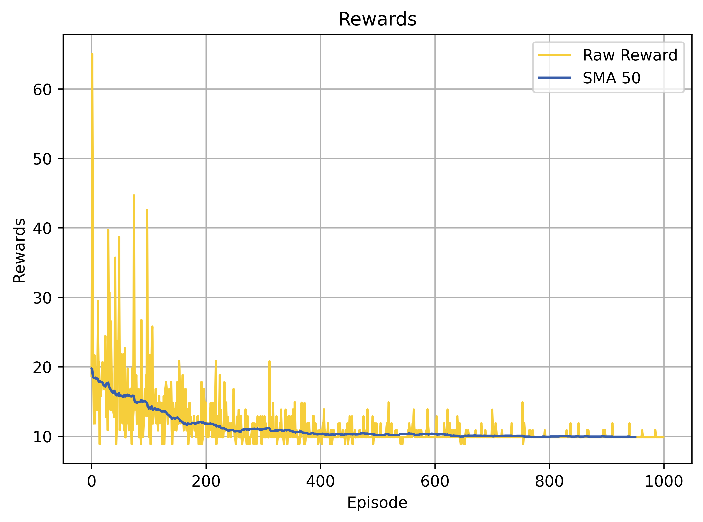

# DQN Hyperparameter Analysis

[](https://colab.research.google.com/drive/1JLVm4wdrtjpMiQP_3SmdOhWjX1hhFLP8?usp=sharing)
[](https://www.python.org/downloads/release/python-380/)
[](https://github.com/MahanVeisi8/RL_practices/Cartpole/DQN/requirements.txt)

## Introduction
This repository explores the impact of various hyperparameters on the performance of the Deep Q-Network (DQN) applied to the Cart Pole problem. Through systematic experiments, we analyze how learning rate, discount factor, and update frequency affect the model's learning efficiency and policy stability.

## Setup
Details on setting up the environment, installing required libraries, and running the notebook in Google Colab.

### Prerequisites
To run this project locally, ensure you have the following Python packages installed:
```bash
pip install gymnasium torch matplotlib renderlab
```

## Hyperparameter Impact Analysis
Overview of the methodology for testing different hyperparameter settings and the rationale behind selecting specific values.

### Learning Rate Variations

The learning rate is a critical hyperparameter in training deep learning models, influencing the speed and stability of the learning process. In this analysis, we experiment with three different learning rates: `1e-2`, `1e-4`, and `1e-6`, to observe their effects on the training dynamics and performance of our DQN model applied to the Cart Pole problem.

#### Experimental Setup
Each learning rate was tested under identical conditions, with the model trained over 1000 episodes. The experiments were conducted in isolated directories to ensure that results from one do not impact another, providing a clean and controlled environment for each test.

#### Impact on Performance
- **Learning Rate 1e-2:** Exhibited faster convergence but was prone to instability in later episodes. This setting showed high variability in reward accumulation per episode, indicating potentially aggressive updates.
- **Learning Rate 1e-4:** Offered a balance between stability and convergence speed. The model demonstrated steady improvement in performance over time, achieving higher average rewards per episode without significant fluctuations.
- **Learning Rate 1e-6:** Resulted in very slow progress with minimal improvements in episode rewards. This rate was too conservative, leading to insufficient updates and slow learning.

#### Visual Analysis
For each learning rate, we plotted the evolution of episode rewards, loss metrics, and the epsilon decay to visually assess the learning process. These plots are crucial for understanding the trade-offs between exploration and exploitation as moderated by the learning rate.

Below are the plots showcasing the evolution of episode rewards and loss metrics for each learning rate. These visual comparisons help to understand the trade-offs between exploration and exploitation as moderated by the learning rate.

| Learning Rate | Loss Plot                          | Reward Plot                        |
|---------------|------------------------------------|------------------------------------|
| **1e-2**      |  |  |
| **1e-4**      | .png) |  |
| **1e-6**      |  |  |


#### Conclusion
The analysis clearly shows that a medium learning rate (1e-4) is optimal for this particular setting, providing a good compromise between learning speed and stability. Both the overly high and overly low learning rates led to suboptimal learning, with either instability or inadequate learning progress.


### Discount Factor Adjustments
Investigation into the influence of discount factor variations on the long-term reward strategy of the DQN agent.

### Update Frequency Modifications
Analysis of how different frequencies for updating the target network impact the convergence and performance of the agent.

## Results and Discussion
Detailed presentation of the training and testing results with comprehensive visual data illustrating trends and key findings.

## Conclusions
Summary of the insights gained from the hyperparameter analysis, including recommendations for choosing optimal settings for similar reinforcement learning tasks.


