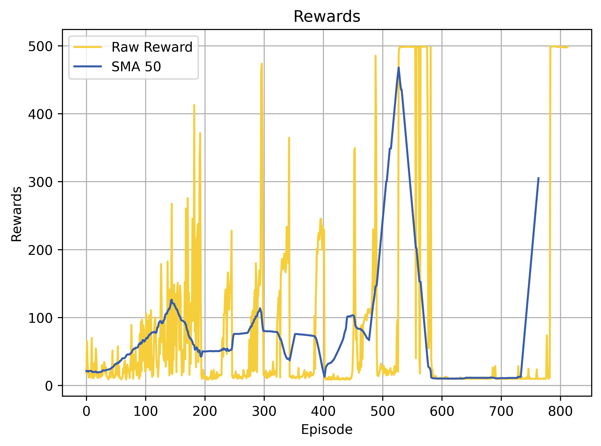
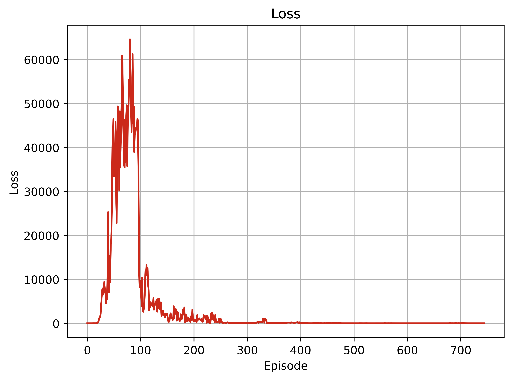

# DQN Hyperparameter Analysis

[](https://colab.research.google.com/drive/1JLVm4wdrtjpMiQP_3SmdOhWjX1hhFLP8?usp=sharing)
[](https://www.python.org/downloads/release/python-380/)
[](https://github.com/MahanVeisi8/RL_practices/Cartpole/DQN/requirements.txt)

## Introduction
This repository explores the impact of various hyperparameters on the performance of the Deep Q-Network (DQN) applied to the Cart Pole problem. Through systematic experiments, we analyze how learning rate, discount factor, and update frequency affect the model's learning efficiency and policy stability.

## Setup
Details on setting up the environment, installing required libraries, and running the notebook in Google Colab.

### Prerequisites
To run this project locally, ensure you have the following Python packages installed:
```bash
pip install gymnasium torch matplotlib renderlab
```

## Hyperparameter Impact Analysis
Overview of the methodology for testing different hyperparameter settings and the rationale behind selecting specific values.

### **Learning Rate Variations**

The learning rate is a critical hyperparameter in training deep learning models, influencing the speed and stability of the learning process. In this analysis, we experiment with three different learning rates: `1e-2`, `1e-4`, and `1e-6`, to observe their effects on the training dynamics and performance of our DQN model applied to the Cart Pole problem.

#### Experimental Setup
Each learning rate was tested under identical conditions, with the model trained over 1000 episodes. The experiments were conducted in isolated directories to ensure that results from one do not impact another, providing a clean and controlled environment for each test.

#### Visual Analysis and Performance Impact

For each learning rate, we have documented how the changes affect the training dynamics and performance outcomes. The tables below include descriptions alongside corresponding plots for loss and rewards, providing a comprehensive view of the impact each learning rate has on the learning process.

| Learning Rate | Description                                                                                                                                                                 | Loss Plot                                                    | Reward Plot                                                  |
|---------------|-----------------------------------------------------------------------------------------------------------------------------------------------------------------------------|--------------------------------------------------------------|--------------------------------------------------------------|
| **1e-2**      | Exhibited faster convergence but was prone to instability in later episodes, with high variability in reward accumulation, indicating potentially aggressive updates.       |         |     |
| **1e-4**      | Offered a balance between stability and convergence speed. The model demonstrated steady improvement, achieving higher average rewards per episode without significant fluctuations. |         |     |
| **1e-6**      | Resulted in very slow progress with minimal improvements in episode rewards. This rate was too conservative, leading to insufficient updates and slow learning.                |         |     |

These plots are crucial for understanding the trade-offs between exploration and exploitation as moderated by the learning rate, offering visual insights into how each setting affects the model's learning efficiency and overall performance.

#### Conclusion
The analysis clearly shows that a medium learning rate (1e-4) is optimal for this particular setting, providing a good compromise between learning speed and stability. Both the overly high and overly low learning rates led to suboptimal learning, with either instability or inadequate learning progress.

### **Discount Factor Variations**

The discount factor is another essential hyperparameter in reinforcement learning that determines the importance given to future rewards. By testing different discount factors: `0.997`, `0.97`, and `0.9`, we investigate their impact on the learning behavior and the overall performance of our DQN model trained on the Cart Pole problem.

#### Experimental Setup
Each discount factor was examined under identical training conditions over 1000 episodes, with each variant run in its dedicated directory to prevent overlap and ensure consistency in the experimental conditions.

#### Visual Analysis and Performance Impact

The following table provides a detailed view of how different discount factors influenced the training outcomes, summarized with key performance descriptions and visualized through corresponding plots.

| Discount Factor | Description                                                                                                                                                  | Loss Plot                                                          | Reward Plot                                                        |
|-----------------|--------------------------------------------------------------------------------------------------------------------------------------------------------------|--------------------------------------------------------------------|--------------------------------------------------------------------|
| **0.997**       | Resulted in an extended focus on future rewards, leading to an impressive performance late in the training with a rapid achievement of high rewards.           |           |       |
| **0.97**        | Achieved a balance between immediate and future rewards, facilitating consistent learning and steady progress throughout the episodes.                        |             |         |
| **0.9**         | Focused more on immediate rewards, which accelerated initial learning but struggled to optimize for long-term gains, showing fluctuations in later performances. |               |           |

These observations reveal that the choice of discount factor significantly affects the strategic balance between short-term gains and long-term rewards, with mid-range values often providing the most balanced approach.

#### Conclusion
This analysis underscores the necessity of carefully tuning the discount factor according to the specific requirements and goals of the learning task. While a higher discount factor can drive the model to achieve optimal performance by focusing on future rewards, it might require careful handling to avoid instability. Conversely, a lower discount factor can enhance early learning but at the cost of long-term performance, which might be crucial for complex tasks requiring foresighted strategies.


### **Update Frequency Variations**

Update frequency in a reinforcement learning setting determines how often the target network is updated with weights from the main network. Adjusting this frequency can impact the learning stability and convergence rate. We evaluated three different update frequencies—5, 50, and 100—to explore their effects on the dynamics and success of our DQN model in solving the Cart Pole problem.

#### Experimental Setup
The model was trained under identical conditions for 1000 episodes for each set update frequency, with each experiment conducted in separate directories to maintain the integrity of the results.

#### Visual Analysis and Performance Impact
The update frequency in reinforcement learning models impacts how often the target network updates with weights from the evaluation network. We tested three different update frequencies—5, 50, and 100—to determine their effects on training stability and performance in the Cart Pole problem.

| Update Frequency | Description                                                                                                                                  | Loss Plot                                                             | Reward Plot                                                           |
|------------------|----------------------------------------------------------------------------------------------------------------------------------------------|-----------------------------------------------------------------------|-----------------------------------------------------------------------|
| **5**            | Achieved the most effective learning, with rapid convergence and completion of training through early stopping, indicating an optimal balance.  |           |       |
| **50**           | Demonstrated slower convergence and did not reach optimal performance within 1000 episodes, suggesting a less efficient learning rate.        |         |     |
| **100**          | Showed the slowest improvement and failed to converge effectively within the given episodes, highlighting inefficiency in update pacing.       |       |   |

These results illustrate that a higher update frequency (e.g., 5) can lead to quicker learning and faster achievement of training goals, such as early stopping criteria, which are indicative of a successful learning process. On the other hand, lower frequencies (50 and 100) struggle to achieve similar results within the same number of training episodes, leading to prolonged learning periods without significant gains in performance.

#### Conclusion
The experiment with update frequencies highlights that more frequent updates (e.g., every 5 episodes) are crucial for faster convergence and early mastery of the task. This frequency allows the model to quickly adapt to the environment, proving to be the most effective in training the DQN model on the Cart Pole problem within a constrained number of episodes. This finding underscores the importance of tuning update frequencies to match specific training dynamics and goals, providing a valuable strategy for optimizing reinforcement learning models.

## Results and Discussion
Detailed presentation of the training and testing results with comprehensive visual data illustrating trends and key findings.

## Conclusions
Summary of the insights gained from the hyperparameter analysis, including recommendations for choosing optimal settings for similar reinforcement learning tasks.


