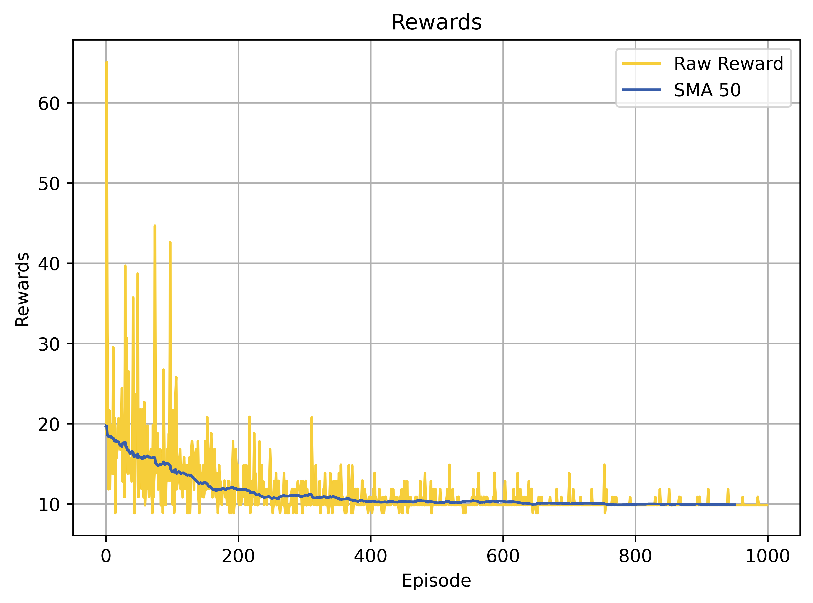
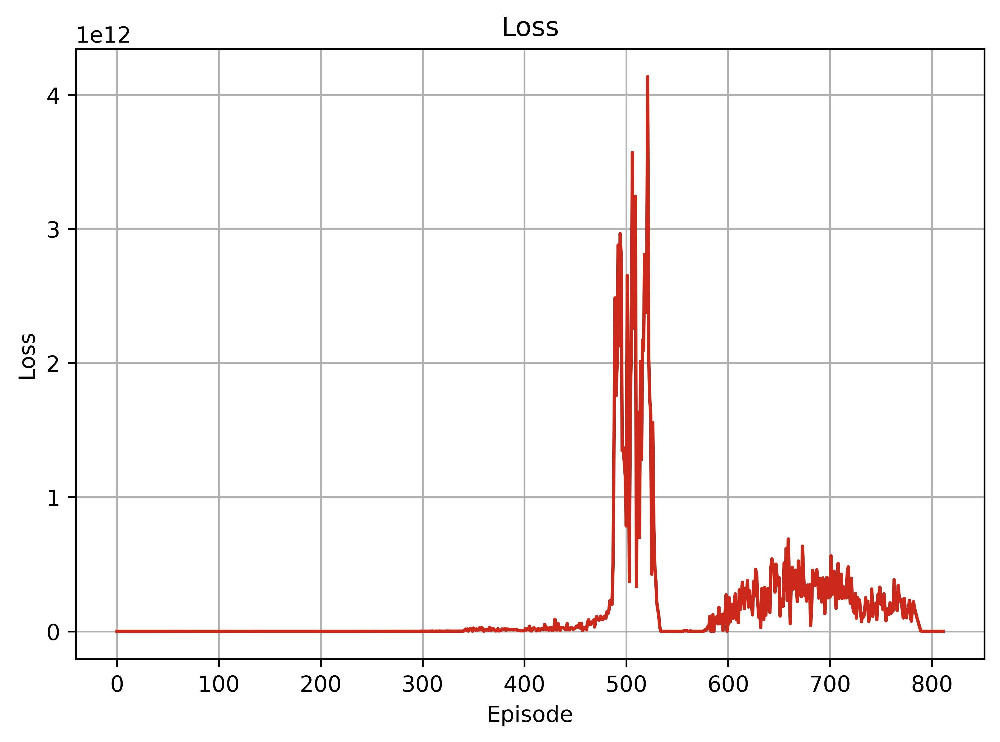
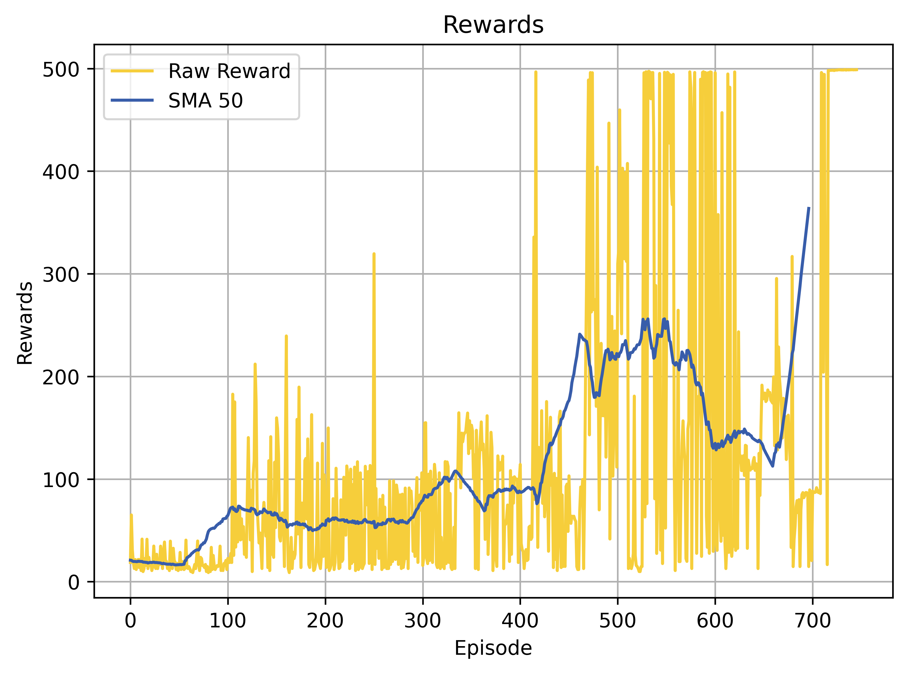

# CartPole RL Practices 🕹️

Welcome to the CartPole RL Practices repository! This repository is divided into four directories, each focusing on a different Reinforcement Learning (RL) technique applied to the classic Cart Pole problem, a popular test environment in RL.

## Table of Contents
- [1 - DQN (Deep Q-Networks)](#1---dqn-deep-q-networks)
- [2 - Hyperparameter Exploration](#2---hyperparameter-exploration)
- [3 - Boltzmann Exploration](#3---boltzmann-exploration)
- [4 - SARSA (State-Action-Reward-State-Action)](#4---sarsa-state-action-reward-state-action)

## 1 - DQN (Deep Q-Networks)
- **[1 - DQN](1%20-%20DQN/)**
- **Goals:** Implement and evaluate the DQN algorithm. Focus on demonstrating how deep learning can be used to solve reinforcement learning problems efficiently.

<table>
  <tr>
    <td>Epoch 10 </td>
    <td>Epoch 500 </td>
    <td>Epoch 1000 </td>
  </tr>
</table>

## 2 - Hyperparameter Exploration
- **[2 - Hyperparameters](2%20-%20Hyperparameters)**
- **Goals:** Analyze and understand the impact of different hyperparameters on the performance of RL algorithms. Using the DQN setup, explore variations in learning rates, discount factors, and update frequencies to optimize performance.

### Learning Rate Variations
| Learning Rate | Loss Plot                                                    | Reward Plot                                                  |
|---------------|--------------------------------------------------------------|--------------------------------------------------------------|
| **1e-2**      |         |     |
| **1e-4**      |         |     |
| **1e-6**      |         |     |

### Discount Factor Variations
| Discount Factor | Loss Plot                                                          | Reward Plot                                                        |
|-----------------|--------------------------------------------------------------------|--------------------------------------------------------------------|
| **0.997**       |           |       |
| **0.97**        |             |         |
| **0.9**         |               |           |

### Update Frequency Variations
| Update Frequency | Loss Plot                                                             | Reward Plot                                                           |
|------------------|-----------------------------------------------------------------------|-----------------------------------------------------------------------|
| **5**            |           |       |
| **50**           |         |     |
| **100**          |       |   |
## 3 - Boltzmann Exploration
- ** **
- **Goals:** Implement Boltzmann exploration strategy within a DQN setup to compare its effectiveness against the epsilon-greedy approach. Focus on the probabilistic approach to action selection based on Q-values.

## 4 - SARSA (State-Action-Reward-State-Action)
- ** **
- **Goals:** Apply the SARSA algorithm to the Cart Pole problem to evaluate its performance in a straightforward RL scenario. Focus on how SARSA's on-policy learning compares to other techniques like DQN.

Each directory contains detailed implementations, experiments, and results that explore various aspects of RL algorithms. Feel free to explore each practice directory for in-depth code, insights, and performance analysis! 😃
