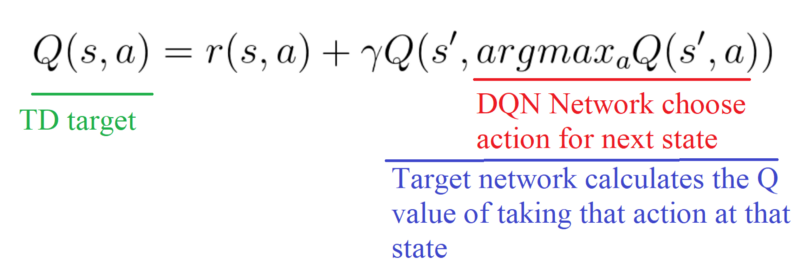
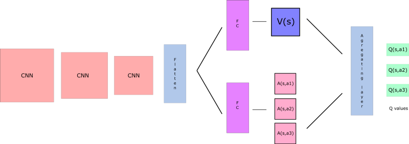
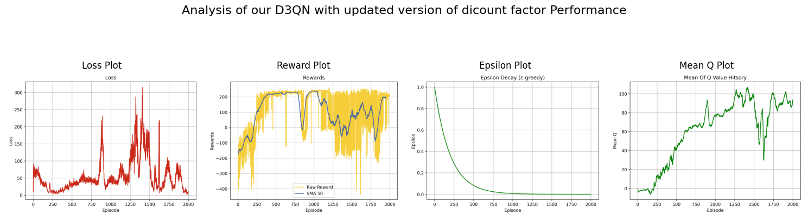
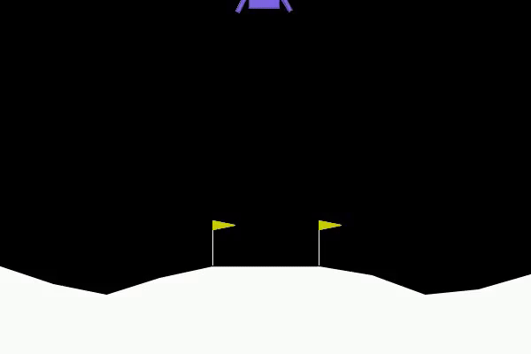
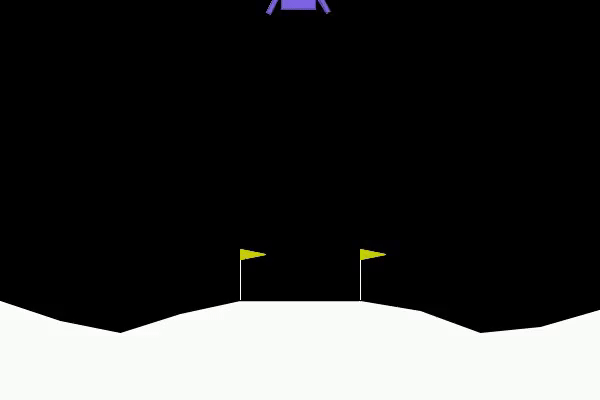
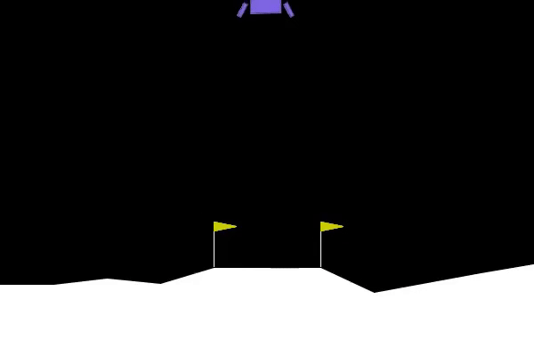

# **Lunar Lander D3QN 🛸**

Welcome to the **Lunar Lander D3QN** project! This repository contains the implementation of a **Dueling Double Deep Q-Network (D3QN)** for solving the Lunar Lander problem, a classic reinforcement learning task. D3QN combines both **Double Q-Learning** and **Dueling Network Architectures** to enhance performance and stability over standard DQN.

---

## **1 - Introduction**

The **Lunar Lander** environment involves controlling a spaceship to land safely on a designated pad using a main engine and two side engines. The goal is to minimize fuel consumption and avoid crashing while landing safely.

This project applies the **D3QN algorithm**, which combines **Double DQN** and **Dueling Network Architectures**, to improve learning stability and policy performance over standard DQN.

---

## **2 - Algorithm Overview**

### **Double DQN**

The Double DQN algorithm addresses the **overestimation bias** of Q-learning by decoupling the selection and evaluation of actions:
- The **main DQN** selects the next action based on the highest Q-value (argmax \(Q(s', a)\)).
- The **target network** computes the Q-value of the selected action.

**Double DQN Update Formula**:

This ensures that the action selection and value estimation are handled separately, reducing the tendency to overestimate action values.

### **Dueling DQN**

The **Dueling Network Architecture** decouples the state value and action advantage, improving stability by allowing the agent to estimate the **state value** \( V(s) \) and the **advantage** of each action \( A(s, a) \) independently:

This architecture enables the network to distinguish between the importance of the state and the action more effectively, improving learning.

**Dueling DQN Architecture**:

---

## **3 - D3QN Implementation**

### **Replay Memory**

The `ReplayMemory` class stores the agent’s experiences, which are then sampled in mini-batches for learning. This helps reduce correlation between sequential experiences, improving learning efficiency.

### **Dueling DQN Network**

The `DuelingDQN_network` class implements the dueling architecture, which separates the estimation of the state value and the action advantage:
- **Shared Network**: Extracts features common to both the value and advantage.
- **Value Stream**: Estimates the value of the current state \( V(s) \).
- **Advantage Stream**: Estimates the advantage of each action \( A(s, a) \).

### **D3QN Agent**

The `D3QN_agent` class orchestrates the training process. Key components include:
- **Epsilon-Greedy Action Selection**: Chooses actions based on Q-values, balancing exploration and exploitation.
- **Learning**: Updates the Q-values using the Double DQN method and the dueling architecture to ensure stability and efficient learning.
- **Target Network**: Soft updates ensure that the target network slowly tracks the main network, further enhancing stability during learning.

---

## **4 - Training and Evaluation**

### **Training Process**

The agent interacts with the environment, collects experiences, and updates its Q-network using mini-batches sampled from the replay memory. The key hyperparameters include:
- **Learning rate**: Controls the step size during learning.
- **Discount factor**: Determines the importance of future rewards.
- **Epsilon decay**: Reduces exploration over time as the agent learns.

The training process aims to improve the agent's ability to land the spacecraft successfully by adjusting its control actions based on state and reward feedback from the environment.

### **Performance Analysis**

The performance of the agent is evaluated based on:
- **Reward accumulation**: Tracks the total reward obtained by the agent over episodes, providing insights into policy improvement.
- **Q-value estimation**: Measures the average Q-values across states, giving an indication of how well the agent is learning the value of actions.
- **Loss reduction**: Observes how the loss decreases as the agent learns from its experiences, a key metric in understanding the convergence of the model.

### **Visualization**

Multiple plots help visualize the training process:
- **Reward Plot**: Shows the reward progression over episodes, illustrating how the agent improves over time.
- **Loss Plot**: Tracks how the model loss changes during training, giving insight into model optimization.
- **Mean Q-Value Plot**: Visualizes the mean Q-value estimates, helping to understand how action values evolve.
- **Epsilon Decay Plot**: Illustrates how exploration decreases over time as the agent learns and shifts more toward exploitation.

---

## **5 - Results**

The D3QN agent demonstrates significant improvement in landing success as training progresses. Here are the agent’s performances across different training epochs:

<table>
  <tr>
    <td>Epoch 10 </td>
    <td>Epoch 750 </td>
    <td>Epoch 1500 </td>
  </tr>
</table>

The training results reveal that the D3QN agent progressively learns more effective landing strategies, particularly after fine-tuning hyperparameters such as epsilon decay and learning rate. You can see the improvements across different training epochs, with better control and more successful landings as training progresses.

---

## **6 - Future Directions**

In future work, we aim to extend this project by exploring:
- **Prioritized Experience Replay**: Implementing a more sophisticated experience replay strategy where experiences with higher TD errors are replayed more often.
- **Noisy Networks for Exploration**: Replacing epsilon-greedy exploration with parameter-based exploration techniques, allowing for more dynamic exploration.
- **Comparison with Other Algorithms**: Evaluating the performance of D3QN against other advanced RL algorithms such as **Rainbow DQN** and **Actor-Critic methods**, to further optimize policy learning.

---

Happy learning and coding! 🚀

