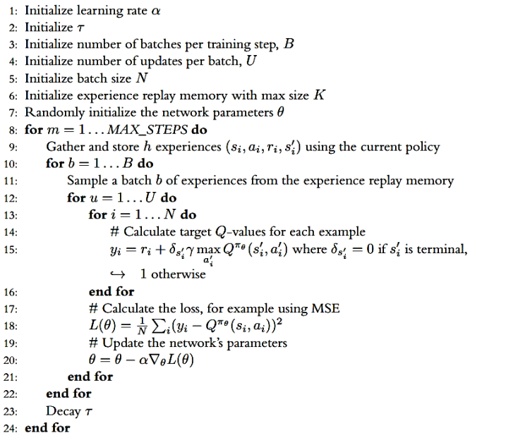

# Lunar Lander DQN 🛸

[](https://colab.research.google.com/drive/1GSWaiwTkF4uRjl7bLwNTlBNBdLjctP3n?usp=sharing)
[](https://www.python.org/downloads/release/python-380/)


Welcome to the **Lunar Lander DQN** project! This project is part of a series of reinforcement learning practices applied to the Lunar Lander environment, a classic challenge in RL. This directory focuses on the implementation and evaluation of the Deep Q-Network (DQN) algorithm.

## Table of Contents
- [1 - Introduction](#1---introduction)
- [2 - DQN Implementation](#2---dqn-implementation)
  - [Replay Memory](#replay-memory)
  - [DQN Network](#dqn-network)
  - [DQN Agent](#dqn-agent)
- [3 - Training and Evaluation](#3---training-and-evaluation)
  - [Training Process](#training-process)
  - [Performance Analysis](#performance-analysis)
  - [Visualization](#visualization)
- [4 - Results](#4---results)
- [5 - Future Directions](#5---future-directions)

## 1 - Introduction
The **Lunar Lander** environment challenges an agent to land a spaceship on a designated landing pad using a main engine and two side engines. The goal is to safely land the spaceship while minimizing fuel usage and avoiding crashes.

This project applies the Deep Q-Network (DQN) algorithm, which combines Q-Learning with deep neural networks to learn effective landing strategies directly from pixel data.


## Setup

**Running the Notebook in Google Colab**
- The notebook is designed for easy execution in Google Colab, requiring no additional setup other than a Google account and internet access.😊
  
The code is designed to run in a Python environment with essential machine learning and simulation libraries. You can execute the notebook directly in Google Colab using the badge link provided, which includes a pre-configured environment with all necessary dependencies.

### Prerequisites
To run this project locally, you need to install the following Python packages. This setup ensures you have all the required libraries:

```bash
pip install gymnasium
pip install torch
pip install matplotlib
pip install renderlab
```

## 2 - DQN Implementation
### Replay Memory
The `ReplayMemory` class stores experiences (state, action, reward, next_state, done) during interactions with the environment. This stored data is later used to train the DQN model by sampling mini-batches.

### DQN Network
The `DQN_Network` class defines the architecture of the neural network used to approximate the Q-value function. The network consists of fully connected layers with ReLU activations.

### DQN Agent
The `DQN_Agent` class manages the core components of the DQN algorithm, including action selection using an epsilon-greedy strategy, learning from the replay memory, updating the target network, and handling the training loop.

## 3 - Training and Evaluation
### Training Process
The training process involves iteratively interacting with the Lunar Lander environment, collecting experiences, and updating the DQN model. Key hyperparameters include learning rate, discount factor, epsilon decay, and memory capacity.

### Performance Analysis
Training performance is analyzed through various metrics such as reward accumulation, loss reduction, and Q-value estimation over episodes.

### Visualization
Several plots are generated to visualize the training progress:
- **Reward Plot:** Tracks the rewards over episodes.
- **Loss Plot:** Shows the reduction in loss during training.
- **Mean Q Plot:** Displays the average Q-values estimated by the network.
- **Epsilon Decay Plot:** Illustrates the reduction in exploration over time.


## 4 - Results
Below are some snapshots of the DQN agent's performance during training:
<table>
  <tr>
    <td>Epoch 10<br></td>
    <td>Epoch 1000<br></td>
    <td>Epoch 1637<br></td>
  </tr>
</table>

The agent shows significant improvement in landing success as training progresses, particularly after fine-tuning the hyperparameters.

## 5 - Future Directions
Future work will extend this project to compare the performance of DQN with other advanced algorithms like **Double DQN** and **Dueling DQN**. Additionally, experiments will be conducted with varying gamma values to study the effect of discount factors on the learning process.

## Colab Links
For the full code and additional resources, you can access the Colab notebooks:
- [Lunar Lander DQN](https://colab.research.google.com/drive/1GSWaiwTkF4uRjl7bLwNTlBNBdLjctP3n?usp=sharing)

Feel free to explore the code, run experiments, and modify the hyperparameters to see how they affect the agent's performance!

Happy coding and learning! 🚀
