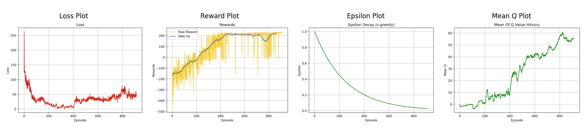

# **Lunar Lander RL Practices 🚀**

[](https://www.python.org/downloads/release/python-380/)
[]()

🌍 **Welcome to the world of Reinforcement Learning (RL) in space!** This repository explores the exciting world of RL through the **Lunar Lander** problem. Whether you're a beginner to RL or a seasoned expert, this is your chance to see how different algorithms tackle the challenge of landing a spaceship 🚀 safely on a designated pad. Explore **DQN**, **D3QN**, and **Adaptive Gamma D3QN** with real performance visualizations and results. Fasten your seatbelts and prepare for takeoff! 🎯

---

## **Table of Contents**
- [1 - DQN (Deep Q-Networks)](#1---dqn-deep-q-networks)
- [2 - D3QN (Dueling Double DQN)](#2---d3qn-dueling-double-dqn)
- [3 - Adaptive Gamma D3QN](#3---adaptive-gamma-d3qn)
- [Results and Visualizations](#results-and-visualizations)
- [Future Work](#future-work:)

## **Results and Visualizations**
## **Future Work: 🚀**

---

## **1 - DQN (Deep Q-Networks)**
- **[DQN Directory](DQN/)**

The **Deep Q-Network (DQN)** algorithm is one of the most fundamental techniques in RL, combining Q-learning with neural networks. In this Lunar Lander problem, the DQN agent learns how to land a spaceship by estimating the Q-values for each action it can take in every state.

### Highlights:
- 🧠 **Q-Learning with Neural Networks**: Q-values are approximated using neural networks.
- 💾 **Replay Memory**: Experiences are stored and used for training the agent in mini-batches.
- 🎲 **Epsilon-Greedy Exploration**: The agent strikes a balance between exploring new actions and exploiting known actions.

**Performance Visualization**:


---

## **2 - D3QN (Dueling Double DQN)**
- **[D3QN Directory](D3QN/)**

**Dueling Double Deep Q-Network (D3QN)** extends the classic DQN approach by combining two powerful techniques: **Double Q-Learning** to reduce overestimation bias and **Dueling Network Architecture** to separately estimate the state-value and action-advantage. Together, they make learning faster and more stable.

### Highlights:
- 📉 **Double Q-Learning**: Reduces overestimation of Q-values by decoupling action selection from action evaluation.
- 🏅 **Dueling Architecture**: Separates the estimation of state-value and action-advantage, improving learning efficiency.
- 🎯 **Target Networks and Replay Memory**: These techniques ensure more stable learning by reducing correlation in the training data.

**Performance Visualization**:


---

## **3 - Adaptive Gamma D3QN**
- **[Adaptive Gamma Directory](adaptive_gamma/)**

What if the agent could **dynamically adjust its focus** on long-term versus short-term rewards during training? That's what the **Adaptive Gamma D3QN** approach does! Inspired by the paper ["How to Discount Deep Reinforcement Learning"](https://arxiv.org/pdf/1512.02011), this method adjusts the discount factor (\(\gamma\)) dynamically to improve learning stability.

### Highlights:
- 🔄 **Dynamic Gamma Adjustment**: Gradually increases the discount factor γ to focus more on long-term rewards as training progresses.
- 📈 **Incremental Gamma Strategy**: 
```css
γ_{k+1} = 1 - 0.98 * (1 - γ_k)
```
  This helps stabilize learning and accelerate convergence.
- 🧠 **D3QN Architecture**: Combines the benefits of Double DQN and Dueling Networks with dynamic gamma adjustments.

**Performance Visualization**:


---

## **Results and Visualizations**

To better compare the performance of each algorithm, here are the results visualized through **loss plots**, **reward plots**, **epsilon decay plots**, and **mean Q-value plots**. These visualizations give you insight into how each algorithm learns over time.

### **Comparison of DQN, D3QN, and Adaptive Gamma D3QN:**

| Metric              | DQN 📊 | D3QN 📈 | Adaptive Gamma D3QN 📉 |
|---------------------|--------|--------|-----------------------|
| **Loss**            | Highly fluctuating, stabilizes towards end | Smoother, fewer fluctuations | Most stable, gradual decline |
| **Reward**          | Large fluctuations | More consistent, but some oscillations | Stable, higher rewards with faster convergence |
| **Epsilon Decay**   | Slow decay over time | Faster decay | Similar to D3QN |
| **Mean Q-Values**   | Steady rise, but slow | Faster rise | Steady and higher overall Q-values |

---

## **Results and Visualizations**

### DQN Results:
<table>
  <tr>
    <td>Epoch 10<br></td>
    <td>Epoch 1000<br></td>
    <td>Epoch 1637<br></td>
  </tr>
</table>

### D3QN Results:
<table>
  <tr>
    <td>Epoch 10<br></td>
    <td>Epoch 750<br></td>
    <td>Epoch 1500<br></td>
  </tr>
</table>

### Adaptive Gamma D3QN Results:
<table>
  <tr>
    <td>Epoch 10<br></td>
    <td>Epoch 500<br></td>
    <td>Epoch 1000<br></td>
  </tr>
</table>

---

## **Future Work: 🚀**

As we push the boundaries of RL in this space adventure, here are some future directions we'd love to explore:

- **🌟 Prioritized Experience Replay**: Focus on more significant experiences to boost learning efficiency.
- **🎲 Noisy Networks**: Introduce noise into network parameters to improve exploration.
- **⚖️ Actor-Critic Comparison**: Explore how **D3QN** stacks up against Actor-Critic methods like **A3C** or **PPO**.
- **🌈 Rainbow DQN**: Combine all the best practices in one — including Double DQN, Dueling Networks, Noisy Nets, and Prioritized Replay for an ultimate RL agent.

---

🎉 **Quote for Thought**: *“The beautiful thing about learning is that nobody can take it away from you.” — B.B. King*

Feel free to explore the code, experiment with parameters, and share your results! The sky (or perhaps space 🚀) is the limit when it comes to Reinforcement Learning. Have fun coding and may your models land softly! 😄

Happy learning! 🚀
