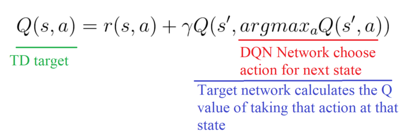
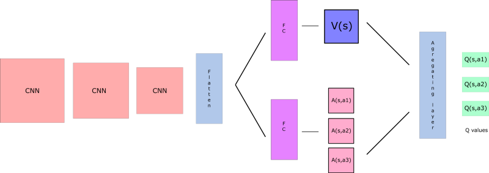
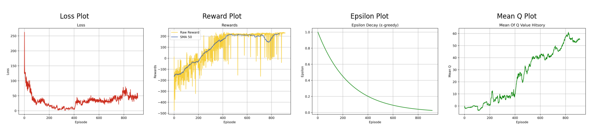

# **Dynamic Gamma D3QN for Lunar Lander 🚀**

[](https://colab.research.google.com/drive/1Q7XqiJByW4MvkK4sUE-fAbWin2-XDpz_?usp=sharing)
[](https://www.python.org/downloads/release/python-380/)


This repository extends the **Dueling Double Deep Q-Network (D3QN)** algorithm to dynamically adjust the **discount factor (gamma)** during training, based on the principles discussed in the paper ["How to Discount Deep Reinforcement Learning"](https://arxiv.org/pdf/1512.02011) by François-Lavet et al. The goal is to accelerate convergence and improve stability in the classic **Lunar Lander** reinforcement learning task.

---

## **1 - Introduction**

The Lunar Lander problem challenges an agent to control a spacecraft and land it safely using a combination of thrust from its engines. The agent's objective is to minimize fuel consumption and avoid crashing while landing on the designated landing pad.

In this project, we build upon the **D3QN** algorithm with a **dynamic discount factor (gamma)** strategy. This approach adjusts the gamma value incrementally during training, based on the findings of François-Lavet et al., to enhance learning stability and speed.

This work builds on the D3QN project from [here](https://github.com/MahanVeisi8/RL_practices/tree/main/Lunar_Lander/D3QN), which used a fixed discount factor.

---

## **2 - Algorithm Overview**

### **Dynamic Discounting in D3QN**

The **dynamic gamma approach** is based on the paper [François-Lavet et al. (2016)](https://arxiv.org/pdf/1512.02011), which proposes incrementing the discount factor gradually over time. By starting with a lower gamma, the agent focuses on short-term rewards initially, avoiding instability caused by large reward estimations. As the agent progresses, the discount factor is slowly increased to focus on long-term reward maximization.

The gamma increment follows this formula:
```scss
γ_{k+1} = 1 - 0.98 * (1 - γ_k)
```
This incremental strategy helps the agent strike a balance between short-term and long-term reward learning, leading to more stable policy improvements.

### **Double DQN Recap**

**Double DQN** addresses the **overestimation bias** in Q-learning by decoupling the action selection and action evaluation steps:
- **Main network** selects the action with the highest Q-value.
- **Target network** calculates the Q-value of the selected action.

**Double DQN Formula**:


### **Dueling Network Recap**

The **Dueling Network Architecture** separates the estimation of the **state value** \(V(s)\) and the **action advantage** \(A(s, a)\), allowing the network to better differentiate between valuable states and optimal actions.

**Dueling Network Architecture**:


---

## **3 - Dynamic D3QN Implementation**

### **Replay Memory**

The `ReplayMemory` class handles the storage of agent experiences and samples mini-batches for learning. This reduces correlations between sequential experiences and improves learning stability.

### **D3QN Agent**

The `D3QN_agent` class manages the training process. It includes:
- **Dynamic Gamma Adjustment**: Gradually increases gamma during training, improving convergence.
- **Epsilon-Greedy Action Selection**: Chooses actions based on Q-values while balancing exploration and exploitation.
- **Soft Target Network Updates**: Ensures the target network slowly tracks the main network for improved stability.

### **Model TrainTest Class**

The `Model_TrainTest` class handles the overall training and evaluation pipeline, including:
- **State Preprocessing**
- **Training Loop**: Interacts with the environment, collects experiences, and updates Q-values using the dynamic discount factor.
- **Testing**: Evaluates the learned policy by loading trained weights and running the agent in the environment.

---

## **4 - Training and Evaluation**

### **Training Process**

The agent is trained with the following key hyperparameters:
- **Dynamic Discount Factor**: \( \gamma \) starts at 0.9965 and increases incrementally during training.
- **Learning Rate**: Adjusts dynamically, starting from 0.0002.
- **Epsilon Decay**: Reduces exploration over time, as the agent becomes more confident in its learned policy.

### **Performance Metrics**
- **Reward accumulation**: Tracks total rewards per episode.
- **Q-value estimation**: Measures average Q-values.
- **Loss reduction**: Indicates how well the agent is learning.

### **Visualization**

The following plots illustrate the learning process:
- **Reward Plot**: Shows the agent’s performance improvement over episodes.
- **Loss Plot**: Tracks the model’s loss during training.
- **Q-value Plot**: Displays the mean Q-values across episodes.
- **Epsilon Decay Plot**: Illustrates the decline in exploration over time.



---

## **5 - Results**

The dynamic gamma strategy has significantly accelerated learning, allowing the agent to achieve stable landings earlier compared to using a fixed discount factor. Below are performance snapshots at different training stages:

<table>
  <tr>
    <td>Epoch 100<br></td>
    <td>Epoch 500<br></td>
    <td>Epoch 1000<br></td>
  </tr>
</table>

---

## **6 - Conclusion and Future Work**

This project demonstrates that **dynamic gamma adjustment** improves both the stability and speed of learning for reinforcement learning agents in the Lunar Lander environment. Future enhancements could include:
- **Prioritized Experience Replay**: Prioritize important experiences for replay.
- **Noisy Networks for Exploration**: Improve exploration by incorporating noise into network weights.
- **Comparison with Rainbow DQN and Actor-Critic Methods**: Further optimize performance by comparing with other advanced RL techniques.

---

## **References**
- François-Lavet, V., et al. "How to Discount Deep Reinforcement Learning: Towards New Dynamic Strategies." [arXiv:1512.02011](https://arxiv.org/pdf/1512.02011).
