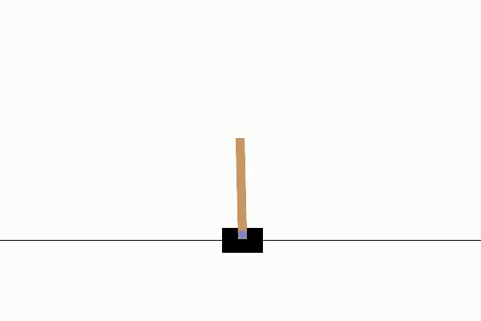
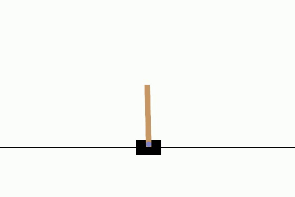

# **Reinforcement Learning Practices 🚀**

🌍 **Welcome to the Reinforcement Learning Practices repository!** This repository is a collection of experiments, projects, and implementations focusing on various **reinforcement learning (RL)** algorithms applied to well-known RL problems. Whether you're a beginner or a researcher, you'll find a range of projects designed to demonstrate the strengths, weaknesses, and capabilities of different RL approaches. 

---

## **Current Projects**
- [**Lunar Lander RL Practices**](Lunar_Lander/): Explore different RL techniques applied to the **Lunar Lander** problem, from **DQN** to **D3QN** and beyond.
- [**CartPole RL Practices**](Cartpole/): A collection of experiments focused on the classic **Cart Pole** problem using various RL algorithms.

---

## **Overview**

### **Lunar Lander RL Practices 🚀**
In this project, we explore multiple reinforcement learning algorithms applied to the **Lunar Lander** problem. The goal is to land a spaceship safely on a designated pad while minimizing fuel consumption and avoiding crashes. The project includes the following RL techniques:
- **Deep Q-Networks (DQN)**
- **Dueling Double DQN (D3QN)**
- **Adaptive Gamma D3QN**

#### **Highlights:**
- **Dynamic Gamma** adjustment for better reward optimization.
- **Dueling Networks** that improve stability and learning efficiency.
- **Visualizations** of learning performance with loss, reward, and Q-value plots.

<table>
  <tr>
    <td>Epoch 10 </td>
    <td>Epoch 1000 </td>
    <td>Epoch 1637 </td>
  </tr>
</table>

Take a deep dive into each subdirectory to explore the implementation and see how each algorithm tackles this complex RL task.

---

### **CartPole RL Practices 🕹️**
This project is a deep exploration of various reinforcement learning strategies applied to the **Cart Pole** problem. The **Cart Pole** problem is a simple but challenging RL task where the agent tries to balance a pole on a cart by applying left or right forces.

#### **Highlights:**
- **Deep Q-Networks (DQN)**
- **Hyperparameter Exploration**: Understand how different settings (learning rate, discount factors) affect the performance.
- **Boltzmann Exploration**: Alternative action-selection strategy compared to epsilon-greedy.
- **SARSA (State-Action-Reward-State-Action)**

Each subdirectory explores different RL techniques and their performance on the Cart Pole problem.

<table>
  <tr>
    <td>Epoch 10 </td>
    <td>Epoch 500 </td>
    <td>Epoch 1000 </td>
  </tr>
</table>

---

## **Future Directions 🚀**

🎉 **Quote for Thought**: *“The beautiful thing about learning is that nobody can take it away from you.” — B.B. King*

As we continue to explore and experiment with reinforcement learning algorithms, here are some future directions for the repository:

- **🌟 Prioritized Experience Replay**: Implement a prioritized replay buffer to sample more important transitions.
- **🌈 Rainbow DQN**: Combine several key improvements in one algorithm, including Double DQN, Dueling Networks, Noisy Nets, and Prioritized Experience Replay.
- **⚖️ Actor-Critic Methods**: Explore more advanced algorithms such as **A3C**, **PPO**, and **DDPG** to tackle continuous action spaces.

---

## **Contributing 🎉**
We welcome contributions from the community! If you have suggestions, improvements, or want to contribute new experiments, please feel free to submit a pull request or open an issue.

Happy exploring and learning! 🚀
