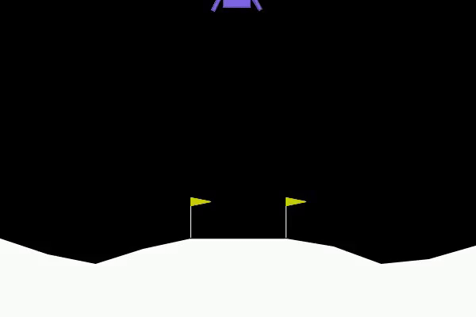

# **Reinforcement Learning Practices 🚀**

🌍 **Welcome to the Reinforcement Learning Practices repository!** This repository is a collection of experiments, projects, and implementations focusing on various **reinforcement learning (RL)** algorithms applied to well-known RL problems. Whether you're a beginner or a researcher, you'll find a range of projects designed to demonstrate the strengths, weaknesses, and capabilities of different RL approaches. 

---

## **Current Projects**
- [**Lunar Lander RL Practices**](Lunar_Lander/): Explore different RL techniques applied to the **Lunar Lander** problem, from **DQN** to **D3QN** and beyond.
- [**CartPole RL Practices**](Cartpole/): A collection of experiments focused on the classic **Cart Pole** problem using various RL algorithms.

---

## **Overview**

### **Lunar Lander RL Practices 🚀**

The **Lunar Lander** environment challenges the agent to land a spaceship safely on a designated pad while minimizing fuel consumption and avoiding crashes. It’s a classic RL task used to test control policies. This project explores various RL approaches to solve this challenge.

#### **Implemented Algorithms**:
- **Deep Q-Networks (DQN)**: Combines Q-Learning with deep neural networks to learn optimal policies.
- **Dueling Double DQN (D3QN)**: Adds improvements like Double Q-Learning and Dueling Networks to address overestimation and stabilize learning.
- **Adaptive Gamma D3QN**: Dynamically adjusts the discount factor *gamma* during training to improve long-term reward learning.

#### **Key Features**:
- 🔄 **Dynamic Gamma Adjustment** for better reward optimization over time.
- 🏅 **Dueling Networks** that separate value from advantage estimations, improving stability and efficiency.
- 📊 **Visualizations** of training progress, including loss, reward, and Q-value plots.

#### **Performance Visualizations**:
<table>
  <tr>
    <td>Epoch 10 </td>
    <td>Epoch 500 </td>
    <td>Epoch 1000 </td>
  </tr>
</table>

Each subdirectory within the **Lunar Lander** project provides an in-depth implementation and visualization of the respective algorithms, showcasing how different methods tackle this complex RL task.

---

### **CartPole RL Practices 🕹️**

The **CartPole** problem is another classic reinforcement learning task where the agent’s goal is to balance a pole on a moving cart. This problem serves as a great testbed for exploring and evaluating various RL algorithms.

#### **Implemented Algorithms**:
- **Deep Q-Networks (DQN)**: A neural network-based method for approximating the Q-value function.
- **Hyperparameter Exploration**: Experiments with different learning rates, discount factors, and other hyperparameters to optimize performance.
- **Boltzmann Exploration**: Uses a probabilistic method to choose actions based on the Q-values, offering an alternative to epsilon-greedy exploration.
- **SARSA (State-Action-Reward-State-Action)**: An on-policy algorithm that learns based on the action it actually took.

#### **Key Features**:
- 🧪 **Experimentation with Hyperparameters**: See how different settings impact learning efficiency and performance.
- 🎲 **Boltzmann Exploration**: A more probabilistic approach to action selection compared to traditional methods.
- 💻 **Detailed Visualizations**: See how different algorithms perform through visual aids like loss and reward plots.

#### **Performance Visualizations**:
<table>
  <tr>
    <td>Epoch 10 </td>
    <td>Epoch 500 </td>
    <td>Epoch 1000 </td>
  </tr>
</table>

Explore each subdirectory for the **CartPole** project to see the detailed implementations and performance analysis of various RL methods.

---

## **Future Directions 🚀**

As we continue to explore and experiment with reinforcement learning algorithms, here are some exciting future directions for the repository:

- **🌟 Prioritized Experience Replay**: Implementing a prioritized replay buffer to sample more important transitions during training, improving learning efficiency.
- **🌈 Rainbow DQN**: Combining multiple improvements like Double DQN, Dueling Networks, Noisy Nets, and Prioritized Replay in a single framework for more efficient learning.
- **⚖️ Actor-Critic Methods**: Exploring more advanced algorithms such as **A3C**, **PPO**, and **DDPG**, which can handle continuous action spaces, for more complex RL tasks.

---

## **Contributing 🎉**

We welcome contributions from the community! Whether you have suggestions, improvements, or new experiments to share, please feel free to submit a pull request or open an issue. Every contribution helps improve and expand the understanding of reinforcement learning in these exciting environments.

Happy exploring and learning! 🚀

---

**Quote for Thought**: 
*“The beautiful thing about learning is that nobody can take it away from you.” — B.B. King*

